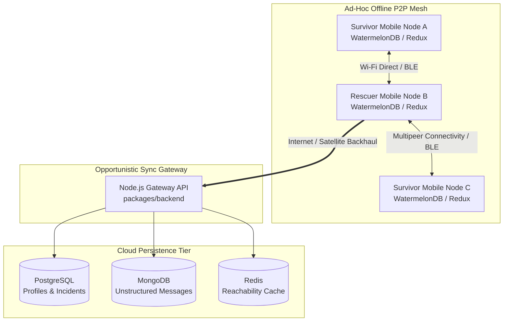
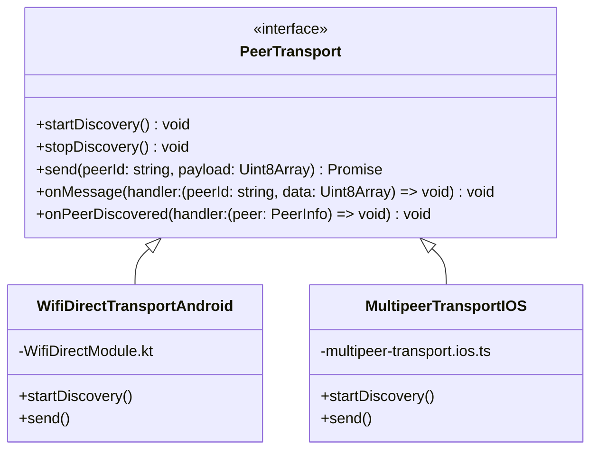

# SOSIFY System Architecture

This document outlines the system architecture, data flow, synchronization topology, multi-radio transport layer, and cryptographic envelope design of the **SOSIFY** (`disaster-p2p-monorepo`) platform.

---

## 1. High-Level Topology

SOSIFY operates as a **decentralized, offline-first peer-to-peer (P2P) mesh communications network** supplemented by an opportunistic **Cloud Synchronization Gateway**.



### Key Architectural Principles
1. **Zero Infrastructure Reliance**: Mobile clients assume cellular and Wi-Fi infrastructure are unavailable at startup. Local persistence (`WatermelonDB`) serves as the single source of truth for the UI.
2. **Opportunistic Epidemic Dissemination**: When nodes encounter each other via BLE or high-bandwidth Wi-Fi Direct/Multipeer connectivity, they perform a **Lamport Clock Vector Exchange** and replicate missing encrypted records locally.
3. **Gateway Uplink**: When any node in the mesh encounters an active internet uplink (e.g., Starlink, restored cellular tower), it acts as a **Relay Gateway**, pushing accumulated offline transactions to `packages/backend`.

---

## 2. Workspace Responsibilities & Data Flow

### `packages/mobile` — Client Application
- **Runtime Environment**: React Native 0.81 running on the Hermes JS Engine, managed via Expo SDK 54.
- **Entry & Routing**: `app/_layout.tsx` initializes global singletons (`ServiceContext` + `Redux Provider`) and injects required Node.js/Crypto polyfills (`../src/utils/polyfills`). Screens are managed via Expo Router (`app/index.tsx`).
- **Service Layer**: 
  - `AuthService`: Manages cryptographic key generation, secure storage (`expo-secure-store`), and user profile state.
  - `ChatService`: Manages P2P messaging, encrypted message wrapping, and local WatermelonDB query/insert operations.
  - `SosService`: Broadcasts high-priority emergency beacons with GPS coordinates (`MapService`).
- **Local Persistence (`WatermelonDB`)**: SQLite-backed reactive database storing:
  - `users`: Local and peer profiles (public keys, battery level, last seen).
  - `messages`: Encrypted P2P message store with Lamport sequence numbers.
  - `incidents`: Geo-tagged SOS distress signals.

### `packages/shared` — Universal Core Library
- **Cryptographic Primitives (`@noble/curves`, `@noble/ciphers`)**:
  - **ECDH P-256 (`secp256r1`)**: Elliptic Curve Diffie-Hellman key agreement for deriving mutual pairwise shared secrets without transmitting private keys.
  - **AES-256-GCM**: Authenticated symmetric encryption for all payload contents (messages, GPS coordinates, incident details).
  - **ECDSA Signatures**: Digital signatures ensuring message authenticity and non-repudiation across multi-hop relays.
  - **HKDF-SHA256**: Key derivation functions transforming ECDH shared secrets into independent encryption and authentication keys.
- **Synchronization Logic (`Lamport Vector Clocks`)**:
  - Implements deterministic CRDT-like merge logic (`merge-logic.ts`) to order concurrent offline events without relying on synchronized wall-clock timestamps (which drift or fail on offline devices).

### `packages/backend` — Synchronization Gateway
- **Stateless Gateway API**: Node.js + TypeScript server receiving batched offline sync payloads.
- **PostgreSQL**: Relational data store retaining verified user profiles, authenticated emergency incidents, and `sync_checkpoints`.
- **MongoDB**: High-throughput document store retaining the immutable historical P2P message archive (`MongoMessageDocument`), indexed by `lamportTimestamp` and `senderId`.
- **Redis**: In-memory cache tracking real-time rescuer reachability heartbeats, active SOS geofence counters, and ephemeral gateway status.

---

## 3. Multi-Radio Transport Layer (`PeerTransport`)

To maximize range, battery efficiency, and bandwidth across heterogeneous devices, SOSIFY implements a unified `PeerTransport` interface abstracted over platform-specific native radio APIs:



### Radio Coordination Strategy
1. **Low-Power Passive Discovery (BLE)**:
   - All nodes continuously broadcast low-power BLE advertisements containing their compressed public identity and current Lamport vector summary.
2. **High-Bandwidth Session Establishment (Wi-Fi Direct / Multipeer)**:
   - **Android (`WifiDirectModule.kt`)**: Uses `WifiP2pManager` to negotiate autonomous Wi-Fi Direct Group Owner/Client roles, opening raw TCP sockets on port `8988` for high-speed database replication.
   - **iOS (`multipeer-transport.ios.ts`)**: Uses Apple's `MultipeerConnectivity` framework (`MCSession`, `MCNearbyServiceAdvertiser`), establishing encrypted ad-hoc Wi-Fi sessions.

---

## 4. Cryptographic Envelope & Security Model

To prevent eavesdropping, tampering, and replay attacks during multi-hop P2P relaying across untrusted intermediary devices, all network transmissions must adhere to the **SOSIFY Cryptographic Envelope**:

```text
+-------------------------------------------------------------------------+
|                        SOSIFY Cryptographic Envelope                     |
+-------------------------------------------------------------------------+
| Header:                                                                 |
|   - Sender Public Key (ECDH P-256, 65 bytes uncompressed)               |
|   - Recipient Public Key (or Broadcast 0x00...00)                       |
|   - Lamport Timestamp (64-bit unsigned integer)                         |
|   - Message ID / Nonce (AES-GCM IV, 12 bytes random)                    |
+-------------------------------------------------------------------------+
| Encrypted Payload (AES-256-GCM using derived HKDF session key):         |
|   - Plaintext JSON body (chat text, GPS coordinates, SOS metadata)      |
|   - Authentication Tag (GCM Auth Tag, 16 bytes)                         |
+-------------------------------------------------------------------------+
| Cryptographic Signature (ECDSA P-256 over SHA-256 of Header + Payload): |
|   - r, s signature components (64 bytes)                                |
+-------------------------------------------------------------------------+
```

### Security Guarantees
- **End-to-End Confidentiality**: Intermediary nodes relaying messages across the mesh cannot decrypt the payload without the recipient's private key.
- **Integrity & Authenticity**: Any alteration to the header, IV, or encrypted ciphertext invalidates the GCM authentication tag and the sender's ECDSA signature.
- **Replay Protection**: The monotonically increasing Lamport timestamp and unique 12-byte initialization vectors prevent replay and packet injection attacks.
