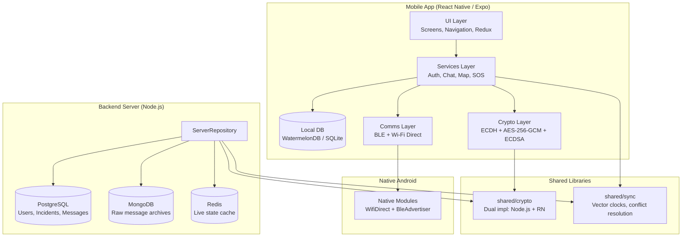
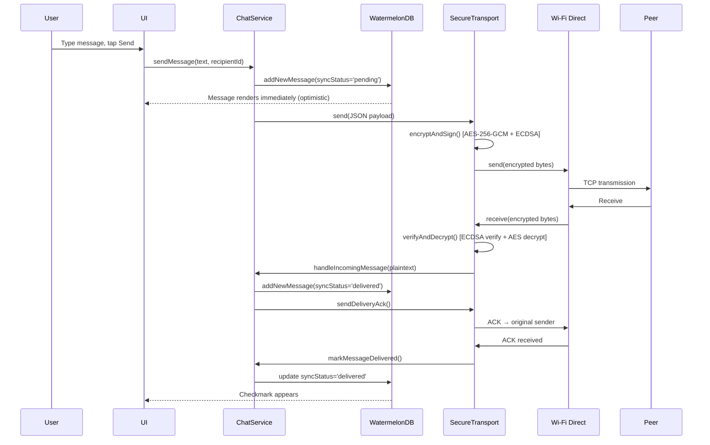
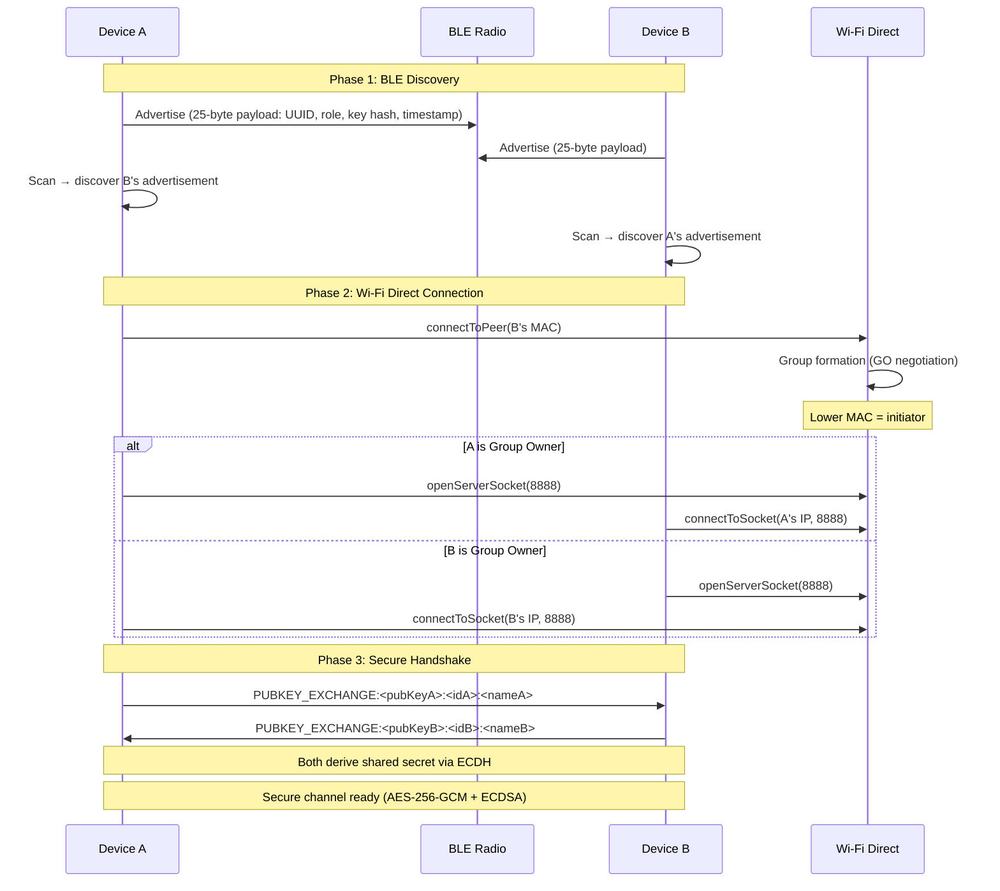

# Disaster P2P Monorepo — Architecture Documentation

A disaster-resilient peer-to-peer communications network. When cellular towers and Wi-Fi access points go offline, this system enables direct device-to-device communication using Bluetooth Low Energy (BLE) for discovery and Wi-Fi Direct for high-bandwidth data transfer.

---

## System Overview

---

## Packages

| Package | Path | Description |
|---------|------|-------------|
| **mobile** | `packages/mobile/` | React Native (Expo) mobile app — Android & iOS |
| **backend** | `packages/backend/` | Node.js data access layer (PostgreSQL + MongoDB + Redis) |
| **shared** | `packages/shared/` | Shared crypto & conflict-free sync libraries |

---

## Domain Documentation

### Shared Libraries
- [**Cryptographic Primitives**](./shared/crypto.md) — ECDH key exchange, AES-256-GCM encryption, ECDSA signatures, SHA-256 hashing, dual implementations (Node.js + React Native)
- [**Sync & Conflict Resolution**](./shared/sync.md) — Lamport vector clocks, conflict detection, role-prioritized resolution, content deduplication

### Mobile App
- [**Database Layer**](./mobile/database.md) — WatermelonDB schema, models, migrations, repository API, deduplication strategy
- [**Services Layer**](./mobile/services.md) — AuthService, ChatService, MapService, SosService, PeerConnectionManager — workflows for messaging, file transfers, SOS, location tracking
- [**Transport Layer**](./mobile/transport.md) — BLE discovery/advertising (25-byte packet format), Wi-Fi Direct TCP, SecureTransport handshake, connection state machine, retry logic, timings
- [**Navigation Structure**](./mobile/navigation.md) — Expo Router + React Navigation, auth flow, tab structure, conditional rendering
- [**UI Screens**](./mobile/ui.md) — Screen documentation, reusable components, design system, platform differences
- [**State Management**](./mobile/state.md) — Redux slices, service initialization, ServiceContext, data flow patterns

### Backend Server
- [**Database Layer**](./backend/database.md) — PostgreSQL schema (ER diagram), MongoDB document schema, Redis key patterns
- [**Repository Layer**](./backend/repository.md) — ServerRepository API, all methods with SQL, null-dependency handling
- [**Workflows**](./backend/workflows.md) — User registration, incident management, message archival, sync vectors, device reachability
- [**API Status**](./backend/api.md) — No HTTP server exists; this is a data access layer only

---

## How the Pieces Fit

### Data Flow: Sending a Message

### Data Flow: Peer Discovery & Connection

---

## Key Design Decisions

| Decision | Rationale |
|----------|-----------|
| **BLE for discovery, Wi-Fi Direct for data** | BLE is low-power for continuous scanning; Wi-Fi Direct provides high-bandwidth TCP for messages and files |
| **AES-256-GCM + ECDSA** | Authenticated encryption — confidentiality + integrity + authenticity in one operation |
| **WatermelonDB (SQLite)** | Offline-first, observable, reactive queries. Designed for mobile P2P sync |
| **Content hash deduplication** | Messages forwarded over multiple mesh paths are deduplicated by SHA-256 hash |
| **Role-prioritized conflict resolution** | Rescuer (responder) overrides victim (user) in conflict scenarios |
| **Dual crypto implementations** | Node.js `crypto` for backend, `@noble/*` for React Native Hermes compatibility |
| **Raw file chunks bypass AES** | File chunks sent unencrypted over Wi-Fi Direct TCP (private local network) to avoid ~200-500ms/chunk AES overhead |
| **Optimistic DB writes** | Messages appear in UI immediately as 'pending' before network transmission |

---

## Guided Reading Order

For someone new to the project:

1. **Start here** — This file (system overview)
2. [**Setup guide**](./setup.md) — Get the project running locally
3. [**Cryptographic Primitives**](./shared/crypto.md) — Understand the security foundation
4. [**Transport Layer**](./mobile/transport.md) — Understand how devices discover and connect
5. [**Database Layer (Mobile)**](./mobile/database.md) — Understand local data model
6. [**Services Layer**](./mobile/services.md) — Understand business logic workflows
7. [**UI & Navigation**](./mobile/ui.md) — Understand the user interface
8. [**Backend Database**](./backend/database.md) — Understand server-side persistence
9. [**Backend Workflows**](./backend/workflows.md) — Understand server-side operations
10. [**Sync & Conflict Resolution**](./shared/sync.md) — Understand offline-first sync
11. [**State Management**](./mobile/state.md) — Understand Redux + service architecture

---

## Legacy Documentation

The following root-level files contain design specifications. The detailed docs above are generated from actual code and should be considered authoritative:

| File | Description | Status |
|------|-------------|--------|
| `CRYPTO.md` | Cryptographic design specification | Superseded by [shared/crypto.md](./shared/crypto.md) |
| `SCHEMA.md` | Database schema documentation | Superseded by [mobile/database.md](./mobile/database.md) and [backend/database.md](./backend/database.md) |
| `TRANSPORT.md` | P2P transport layer design | Superseded by [mobile/transport.md](./mobile/transport.md) |

> **Note:** The legacy docs may contain aspirational designs that differ from actual implementation. The per-domain docs cite specific file paths and line numbers for traceability.
