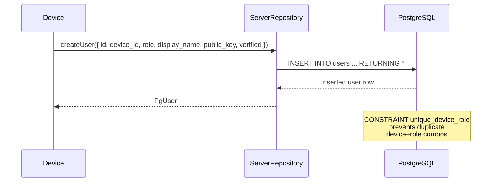
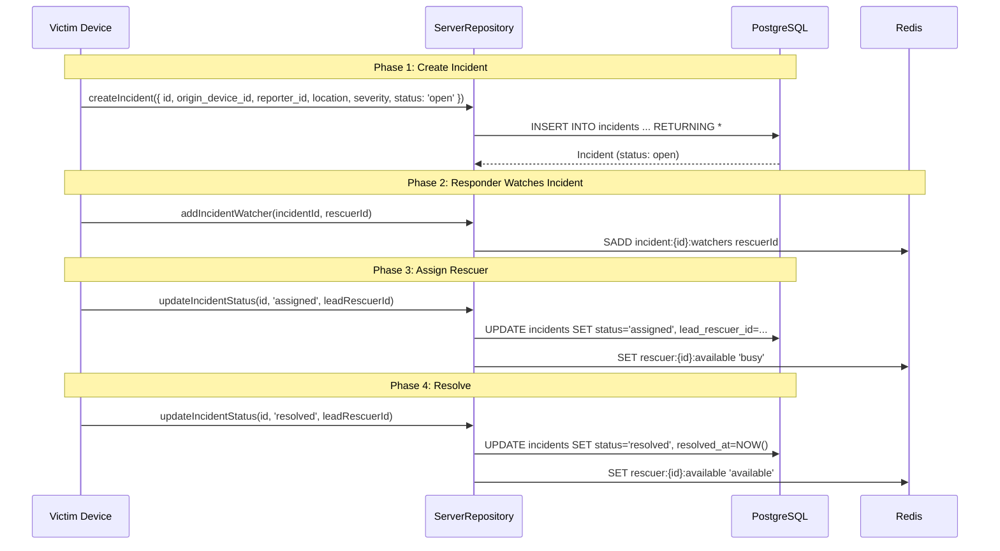
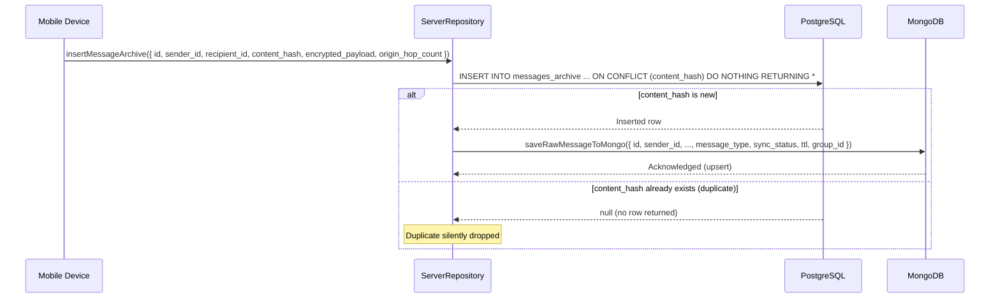
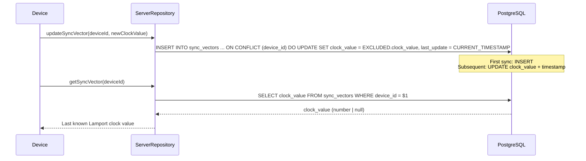
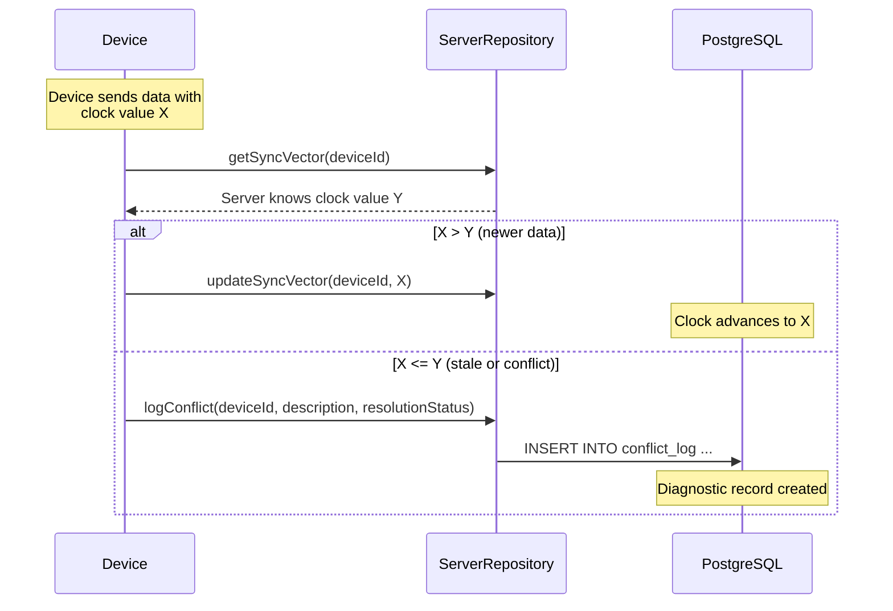
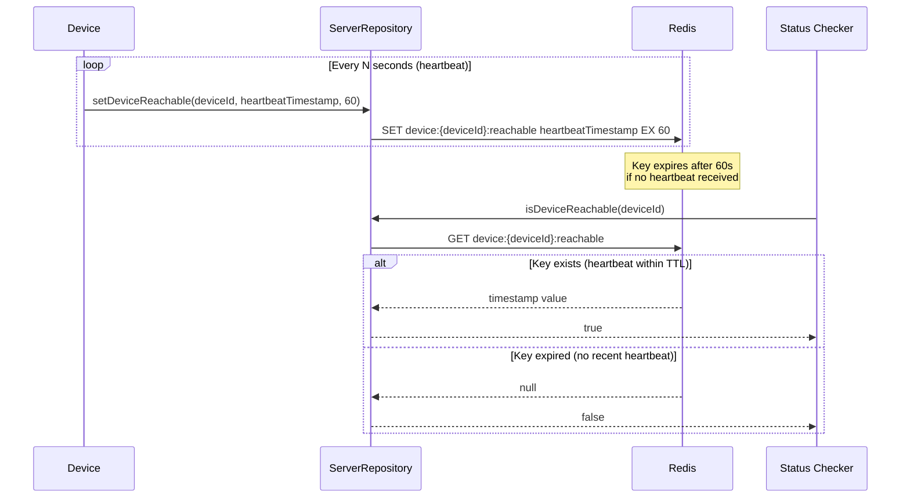
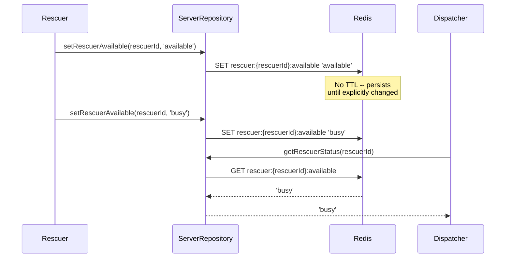
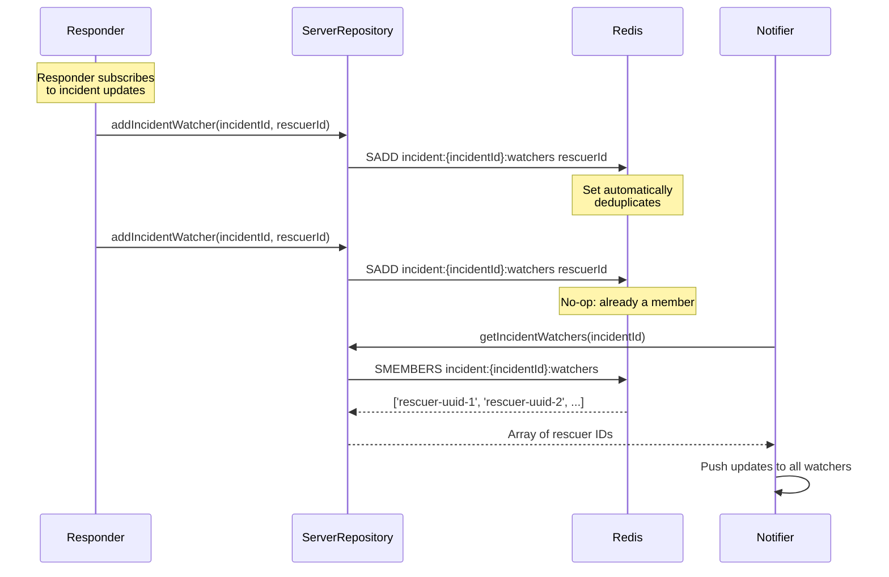

# Backend API & Workflows

> Source: All files under `packages/backend/src/`

---

## 1. HTTP/API Server Status

**No HTTP server exists in this package.**

The `packages/backend/` directory contains only:
- `src/db/schema.sql` -- PostgreSQL DDL
- `src/db/mongo-schema.ts` -- MongoDB document type definitions
- `src/db/repository.ts` -- Data access layer (`ServerRepository` class)
- `src/cache/redis-config.ts` -- Redis key patterns and client factory

There are **no**:
- Express/Fastify/Koa server files
- Route definitions
- Request/response types
- Authentication middleware
- WebSocket handlers
- GraphQL schemas

The `package.json` references `dist/index.js` as the entry point (line 6), but no `src/index.ts` file exists in the current codebase. This package is a **data access layer only**, intended to be consumed by another service (likely a relay server or API gateway in a different package).

**Dependencies** (`package.json`):
- `pg` ^8.12.0 -- PostgreSQL client
- `mongodb` ^6.7.0 -- MongoDB driver
- `redis` ^4.6.14 -- Redis client
- `shared` workspace:* -- Shared types/utilities from the monorepo

---

## 2. Workflows

### 2.1 User Registration Workflow



**Data stored:**
| Store | Data | Notes |
|---|---|---|
| PostgreSQL `users` | `id`, `device_id`, `role`, `display_name`, `public_key`, `verified`, `created_at` | System of record |
| MongoDB | None | Not involved in registration |
| Redis | None | Not involved in registration |

**Validation**: CHECK constraint on `role` limits values to `'user' | 'responder' | 'admin'` (schema.sql:17). UNIQUE constraint on `(device_id, role)` prevents duplicate registrations (schema.sql:22).

---

### 2.2 Incident Management Workflow



**State machine:**
```
open --> assigned --> resolved
```

**Data stored per phase:**
| Phase | PostgreSQL | Redis |
|---|---|---|
| Create | `incidents` row (status: `open`) | -- |
| Watch | -- | `incident:{id}:watchers` set gains member |
| Assign | `incidents.status` -> `assigned`, `lead_rescuer_id` set | `rescuer:{id}:available` -> `busy` |
| Resolve | `incidents.status` -> `resolved`, `resolved_at` set | `rescuer:{id}:available` -> `available` |

**Querying**: `listIncidents({ status?, severity? })` supports filtering by either or both fields (repository.ts:90-107).

---

### 2.3 Message Archival Workflow



**Deduplication mechanism:**
1. Mobile computes `content_hash` (SHA-256) of the encrypted payload.
2. PostgreSQL `ON CONFLICT (content_hash) DO NOTHING` silently drops duplicates (repository.ts:121).
3. If `insertMessageArchive` returns `null`, the caller knows it was a duplicate.

**MongoDB vs PostgreSQL storage:**
| Field | PostgreSQL | MongoDB |
|---|---|---|
| `id` | Yes | Yes (cross-reference key) |
| `sender_id` | Yes | Yes |
| `recipient_id` | Yes | Yes |
| `content_hash` | Yes | Yes |
| `encrypted_payload` | Yes | Yes |
| `origin_hop_count` / `hop_count` | Yes (`origin_hop_count`) | Yes (`hop_count`) |
| `created_at` | Yes | Yes |
| `group_id` | No | Yes |
| `ttl` | No | Yes |
| `message_type` | No | Yes |
| `origin_device_id` | No | Yes |
| `sync_status` | No | Yes |

---

### 2.4 Sync Vector Workflow



**Conflict detection flow:**


**Key implementation details:**
- `updateSyncVector` uses upsert (`ON CONFLICT ... DO UPDATE`) -- repository.ts:130-136.
- `logConflict` generates a new UUID per conflict via `crypto.randomUUID()` -- repository.ts:146-147.
- `sync_vectors` table has `device_id` as PRIMARY KEY -- one clock per device (schema.sql:78).

---

### 2.5 Device Reachability Workflow



**Mechanism:**
- **Heartbeat**: Device sends periodic heartbeats via `setDeviceReachable()` with a timestamp and TTL (default 60s) -- repository.ts:179-185.
- **TTL-based detection**: Redis key expires automatically. Absence = offline.
- **No background process needed**: Redis handles expiry natively.

### Rescuer Availability Tracking



**Note**: Rescuer availability in Redis is independent of the `rescuer_teams.status` column in PostgreSQL. Redis is the fast-path cache; PostgreSQL is the system of record.

---

### 2.6 Incident Watching Workflow



**Key details:**
- Uses Redis `SET` type -- automatic deduplication of watcher IDs (repository.ts:209).
- No TTL on watcher sets -- watchers persist until the set is explicitly modified.
- **Missing feature**: No `removeIncidentWatcher` method exists. Once added, a watcher cannot be removed via the current API.

---

## 3. Missing Features & Gaps

| Feature | Status | Impact |
|---|---|---|
| **HTTP/REST server** | Not implemented | No external API; package is data-layer only |
| **`src/index.ts`** | Referenced in `package.json` but missing | Package cannot start |
| **Authentication middleware** | Not implemented | No request authentication |
| **`removeIncidentWatcher`** | Not implemented | Watchers cannot unsubscribe |
| **Transaction support** | Not implemented | No multi-table atomic operations in repository |
| **`rescuer_teams` CRUD** | Not implemented | Table exists in schema but no repository methods |
| **MongoDB `queryMongoMessages` typing** | `filters: any` | No type safety on Mongo queries |
| **`logConflict` crypto import** | Inline `require('crypto')` | Should be top-level import |
| **Redis `rescuerAvailable` TTL** | No TTL | Status persists forever until overwritten |
| **WebSocket/SSE for watchers** | Not implemented | No real-time push to incident watchers |
| **Pagination on `listIncidents`** | Not implemented | Returns all matching incidents |
| **Soft deletes** | Not implemented | Schema uses `ON DELETE CASCADE` (hard delete) |
