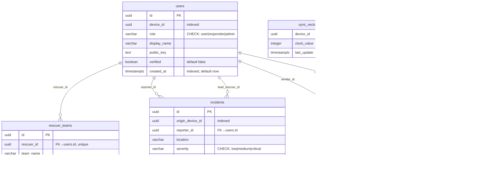

# Backend Database Layer

> Source: `packages/backend/src/db/` and `packages/backend/src/cache/`

---

## 1. PostgreSQL Schema

> Source: `schema.sql` (94 lines)

### 1.1 Entity-Relationship Diagram



### 1.2 Table Reference

| Table | Rows | Purpose |
|-------|------|---------|
| `users` | All registered participants | Identity, public keys, roles |
| `rescuer_teams` | Active responders | Team assignment and availability |
| `incidents` | Emergency reports | SOS events aggregated from clients |
| `messages_archive` | Encrypted message backups | Deduplication by `content_hash` |
| `sync_vectors` | Per-device Lamport clocks | Causal ordering for sync |
| `conflict_log` | Replication conflict trace | Diagnostic/audit trail |

### 1.3 Constraints & Indexes

**Users:**
- `UNIQUE(device_id, role)` — one profile per device per role
- Indexes: `device_id`, `created_at`

**Rescuer Teams:**
- `UNIQUE(rescuer_id)` — one team per rescuer
- `ON DELETE CASCADE` from users
- Index: `status`

**Incidents:**
- `CHECK(severity IN ('low', 'medium', 'critical'))`
- `CHECK(status IN ('open', 'assigned', 'resolved'))`
- Indexes: `origin_device_id`, `created_at`, `status`

**Messages Archive:**
- `UNIQUE(content_hash)` — SHA-256 deduplication
- `ON CONFLICT (content_hash) DO NOTHING` on insert
- Indexes: `sender_id`, `recipient_id`, `created_at`

**Sync Vectors:**
- Primary key is `device_id` (one clock per device)

**Conflict Log:**
- Indexes: `device_id`, `created_at`

---

## 2. MongoDB Schema

> Source: `mongo-schema.ts` (17 lines)

### 2.1 Document Structure

Collection: `messages`

```typescript
export interface MongoMessageDocument {
  _id?: ObjectId;
  id: string;              // matches Postgres messages_archive.id
  sender_id: string;
  recipient_id: string | null;
  group_id: string | null;
  content_hash: string;    // SHA-256
  encrypted_payload: string;
  hop_count: number;
  ttl: number;
  origin_device_id: string;
  message_type: 'text' | 'location_share' | 'sos' | 'system';
  created_at: Date;
  sync_status: 'pending' | 'archived';
}
```

### 2.2 Purpose

MongoDB holds **raw, unstructured message archives** — the complete metadata packet including fields like `group_id`, `ttl`, and `message_type` that don't have columns in PostgreSQL. It serves as a flexible cold-storage backup.

### 2.3 Cross-Reference

MongoDB `id` field maps to PostgreSQL `messages_archive.id` for cross-referencing between the two stores.

---

## 3. Redis Key Design

> Source: `redis-config.ts` (45 lines)

### 3.1 Key Patterns

| Key Pattern | Type | Value | TTL | Purpose |
|-------------|------|-------|-----|---------|
| `device:{device_id}:reachable` | String | Heartbeat Unix timestamp | 60s | Device liveness detection |
| `rescuer:{rescuer_id}:available` | String | `'available'` \| `'busy'` \| `'offline'` | None | Rescuer availability status |
| `incident:{incident_id}:watchers` | Set | Set of rescuer IDs | None | Real-time incident observers |

### 3.2 Key Generator Functions

```typescript
export const RedisKeys = {
  deviceReachable: (deviceId: string) => `device:${deviceId}:reachable`,
  rescuerAvailable: (rescuerId: string) => `rescuer:${rescuerId}:available`,
  incidentWatchers: (incidentId: string) => `incident:${incidentId}:watchers`,
};
```

### 3.3 Reconnection Strategy

```typescript
reconnectStrategy: (retries: number) => {
  return Math.min(retries * 50, 2000);  // Linear backoff, max 2s
}
```

---

## 4. Repository API (`ServerRepository`)

> Source: `repository.ts` (217 lines)
> Constructor: `new ServerRepository(pgPool: Pool, mongoDb: Db | null, redisClient: RedisClientType | null)`

### 4.1 PostgreSQL Operations

| Method | SQL | Behavior |
|--------|-----|----------|
| `createUser(user)` | `INSERT INTO users ... RETURNING *` | Creates user profile |
| `getUser(id)` | `SELECT * FROM users WHERE id = $1` | Lookup by UUID |
| `createIncident(incident)` | `INSERT INTO incidents ... RETURNING *` | Creates incident |
| `updateIncidentStatus(id, status, leadRescuerId)` | `UPDATE incidents SET status=$2, lead_rescuer_id=$3, resolved_at=...` | Status transitions |
| `listIncidents(filters)` | `SELECT * FROM incidents WHERE 1=1 [AND status=$1] [AND severity=$2] ORDER BY created_at DESC` | Filtered listing |
| `insertMessageArchive(msg)` | `INSERT INTO messages_archive ... ON CONFLICT (content_hash) DO NOTHING RETURNING *` | Dedup insert |
| `updateSyncVector(deviceId, clockValue)` | `INSERT INTO sync_vectors ... ON CONFLICT (device_id) DO UPDATE SET clock_value=EXCLUDED.clock_value` | Upsert Lamport clock |
| `getSyncVector(deviceId)` | `SELECT clock_value FROM sync_vectors WHERE device_id = $1` | Get current clock |
| `logConflict(deviceId, description, resolutionStatus)` | `INSERT INTO conflict_log ...` | Audit trail entry |

### 4.2 MongoDB Operations

| Method | Behavior |
|--------|----------|
| `saveRawMessageToMongo(doc)` | `updateOne({id}, {$set: doc}, {upsert: true})` on `messages` collection |
| `queryMongoMessages(filters)` | `find(filters).toArray()` on `messages` collection |

### 4.3 Redis Operations

| Method | Key | Behavior |
|--------|-----|----------|
| `setDeviceReachable(deviceId, heartbeat, ttl=60)` | `device:{id}:reachable` | `SET` with `EX ttl` |
| `isDeviceReachable(deviceId)` | `device:{id}:reachable` | `GET`, returns `true` if non-null |
| `setRescuerAvailable(rescuerId, status)` | `rescuer:{id}:available` | `SET` status string |
| `getRescuerStatus(rescuerId)` | `rescuer:{id}:available` | `GET` status string |
| `addIncidentWatcher(incidentId, rescuerId)` | `incident:{id}:watchers` | `SADD` rescuer to set |
| `getIncidentWatchers(incidentId)` | `incident:{id}:watchers` | `SMEMBERS` returns array |

### 4.4 Null Dependency Handling

All MongoDB and Redis methods check for `null` before operating:
```typescript
async saveRawMessageToMongo(doc: MongoMessageDocument): Promise<void> {
  if (!this.mongoDb) return;  // Silently skip if MongoDB not configured
  // ...
}
```

This allows the server to run with PostgreSQL only, or any combination of the three stores.

---

## 5. Missing Features

| Feature | Status | Description |
|---------|--------|-------------|
| **HTTP/REST API** | Missing | No server entry point. `src/index.ts` referenced in `package.json` but doesn't exist. |
| **rescuer_teams CRUD** | Missing | Table defined in schema but zero repository methods. |
| **removeIncidentWatcher** | Missing | Watchers can subscribe but never unsubscribe. |
| **Transactions** | Missing | All operations are single-statement. No multi-table atomicity. |
| **User deletion** | Missing | No `deleteUser` method. |
| **Incident deletion** | Missing | No `deleteIncident` method. |
| **Pagination** | Missing | `listIncidents` returns all matching rows. No limit/offset. |
