# Backend Workflows

> Source: `packages/backend/src/db/repository.ts`

---

## 1. User Registration Workflow

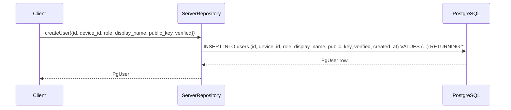

**Constraints enforced by DB:**
- `UNIQUE(device_id, role)` — prevents duplicate registrations
- `CHECK(role IN ('user', 'responder', 'admin'))` — validates role

---

## 2. Incident Management Workflow

### 2.1 Create Incident

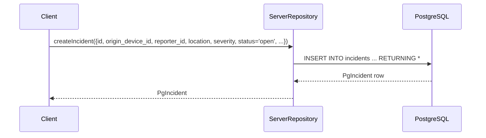

### 2.2 Assign Rescuer

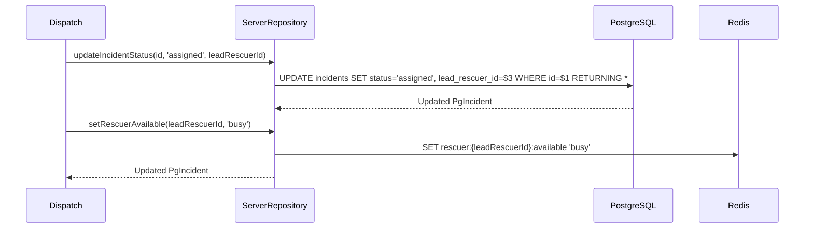

### 2.3 Resolve Incident

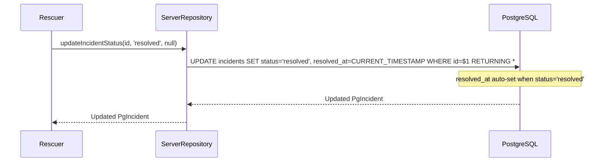

### 2.4 List Incidents

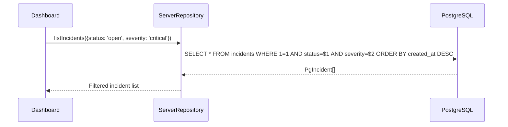

---

## 3. Message Archival Workflow

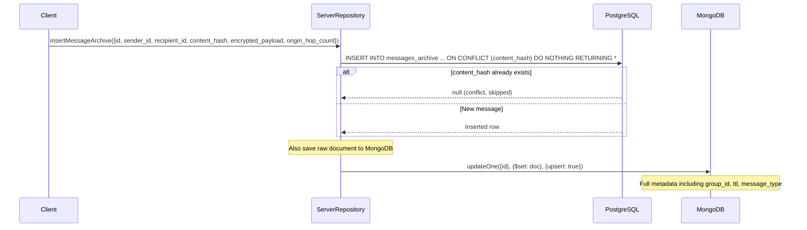

**Deduplication**: PostgreSQL `ON CONFLICT (content_hash) DO NOTHING` prevents duplicate messages from being archived when the same message arrives via multiple mesh paths.

---

## 4. Sync Vector Workflow

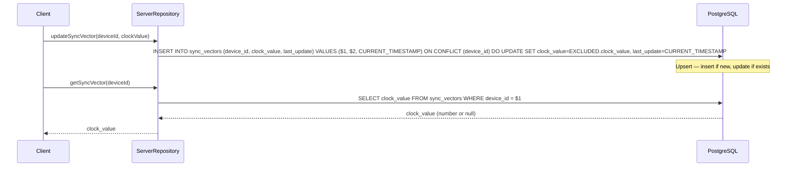

**Purpose**: Lamport logical clocks track causal ordering of events across devices. Each device maintains its own clock value, updated on every sync.

---

## 5. Device Reachability Workflow

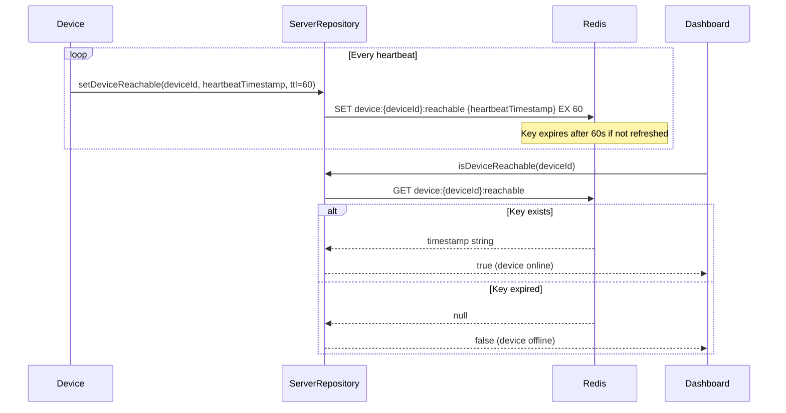

**TTL-based liveness**: Device is considered offline if no heartbeat received within 60 seconds.

---

## 6. Incident Watching Workflow

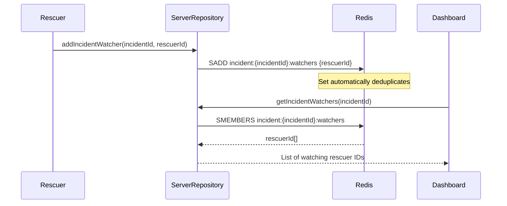

> **Flag:** No `removeIncidentWatcher` method exists. Once a rescuer subscribes, they cannot unsubscribe. The set grows unbounded.

---

## 7. Conflict Logging Workflow

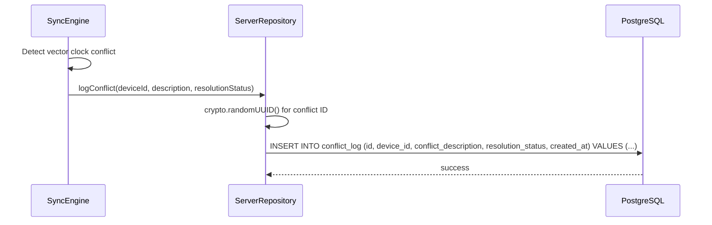

**Purpose**: Audit trail for debugging sync conflicts. Records which device caused the conflict, what the conflict was, and how it was resolved.

---

## 8. Rescuer Availability Workflow

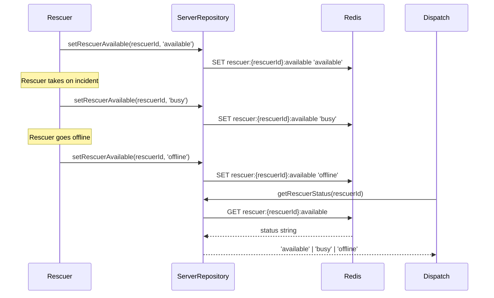

**Note**: No TTL on rescuer status keys. Status persists until explicitly changed.
