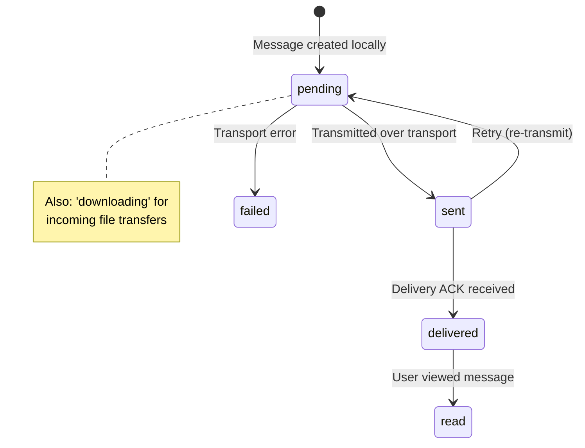

# Mobile Database Layer

> Source: `packages/mobile/src/db/`
> ORM: [WatermelonDB](https://github.com/Nozbe/WatermelonDB) v0.27+
> Schema version: **3**

---

## 1. Entity-Relationship Diagram

```mermaid
erDiagram
    local_user {
        string id PK "WatermelonDB auto-generated"
        string device_id "UUID v4"
        string role "user | responder | admin"
        string public_key "ECDH public key hex"
        string display_name
        number created_at "epoch ms, readonly"
    }

    known_peers {
        string id PK
        string device_id "indexed"
        string public_key
        string role "user | responder | admin"
        string display_name "optional"
        number last_seen "indexed, epoch ms"
        string last_known_location "JSON {lat,lng,timestamp}"
        string trust_status "trusted | untrusted | pending"
    }

    messages {
        string id PK "caller-supplied UUID"
        string sender_id "indexed"
        string recipient_id "indexed, optional"
        string group_id "optional"
        string ciphertext "plaintext or JSON with attachment"
        string signature
        string content_hash "indexed, SHA-256 dedup key"
        number hop_count
        number ttl
        string origin_device_id
        number created_at "indexed, epoch ms"
        string sync_status "pending | sent | delivered | failed | downloading | read"
    }

    sos_events {
        string id PK
        string reporter_id
        number lat
        number lng
        number accuracy
        string location_source "gps | relay | dead-reckoning"
        string severity "low | medium | critical"
        string status "open | assigned | resolved"
        string assigned_rescuer_id "optional"
        number created_at "epoch ms"
    }

    location_log {
        string id PK
        string device_id "indexed"
        number lat
        number lng
        number accuracy
        string source "gps | relay | dead-reckoning"
        number timestamp "epoch ms, readonly"
    }

    sync_queue {
        string id PK
        string record_type
        string record_id
        number attempts
        number last_attempt_at "optional"
        number created_at "epoch ms, readonly"
    }
```



---

## 2. Table Reference

| Table | Indexed columns | Notes |
|---|---|---|
| `local_user` | *(none)* | Singleton row — at most one local identity. `created_at` is `@readonly`. |
| `known_peers` | `device_id`, `last_seen` | `last_known_location` stored as JSON string. |
| `messages` | `sender_id`, `recipient_id`, `content_hash`, `created_at` | `content_hash` is the deduplication key (SHA-256). |
| `sos_events` | *(none)* | Status lifecycle: `open → assigned → resolved`. |
| `location_log` | `device_id` | Append-only log of GPS fixes. |
| `sync_queue` | *(none)* | Retry queue for outbound records. |

---

## 3. Migration History

| Version | Changes | File ref |
|---|---|---|
| **1** | Initial schema (all 6 tables). | `schema.ts:24-100` |
| **2** | Added `display_name` (string, optional) to `known_peers`. | `schema.ts:7-16` |
| **3** | No column changes — bump was for `recipient_id` indexing (index declared inline in v1 table definition). | `schema.ts:17-21` |

> **Flag:** Migration v3 has empty `steps: []` array (`schema.ts:19`). The `recipient_id` index is declared in the base table schema at `schema.ts:53`. The empty migration step is misleading.

---

## 4. Models

> Source: `models.ts` (76 lines)

All models extend `@nozbe/watermelondb` `Model`. Column mapping uses decorators:

| Decorator | Purpose |
|---|---|
| `@text(col)` | Maps to a `string` column |
| `@field(col)` | Maps to a `number` / `boolean` column |
| `@readonly` | Prevents writes after creation (used on `created_at`, `timestamp`) |

### 4.1 Model Classes

| Class | Table | Key properties |
|---|---|---|
| `LocalUser` | `local_user` | `deviceId`, `role`, `publicKey`, `displayName`, `createdAt` |
| `KnownPeer` | `known_peers` | `deviceId`, `publicKey`, `role`, `displayName`, `lastSeen`, `lastKnownLocation`, `trustStatus` |
| `Message` | `messages` | `senderId`, `recipientId`, `groupId`, `ciphertext`, `signature`, `contentHash`, `hopCount`, `ttl`, `originDeviceId`, `createdAt`, `localSyncStatus` |
| `SosEvent` | `sos_events` | `reporterId`, `lat`, `lng`, `accuracy`, `locationSource`, `severity`, `status`, `assignedRescuerId`, `createdAt` |
| `LocationLog` | `location_log` | `deviceId`, `lat`, `lng`, `accuracy`, `source`, `timestamp` |
| `SyncQueue` | `sync_queue` | `recordType`, `recordId`, `attempts`, `lastAttemptAt`, `createdAt` |

### 4.2 The `raw()` Helper Pattern

```typescript
// repository.ts:9-11
function raw(record: { _raw: any }): Record<string, any> {
  return record._raw;
}
```

WatermelonDB's `update()` callback receives a `Model` whose TypeScript type only exposes `_raw: { id, _status, _changed }`. At runtime, `_raw` contains **all schema columns** with their snake_case DB names. The `raw()` helper casts to `any` and returns the underlying record so that writes like `raw(record).device_id = '...'` bypass the decorator-typed properties.

> **Flag:** The `raw()` helper returns `Record<string, any>` — there is **zero type safety** on column writes. A typo like `raw(record).devce_id` would silently write to a non-existent column.

---

## 5. Repository API (`MobileRepository`)

> Source: `repository.ts` (261 lines)
> Constructor: `new MobileRepository(db: Database)`

### 5.1 Local User Operations

| Method | Parameters | Returns | Behavior |
|---|---|---|---|
| `getLocalUser()` | — | `Promise<LocalUser \| null>` | Fetches all rows from `local_user`, returns first or `null`. |
| `setLocalUser(userInfo)` | `{ deviceId, role, publicKey, displayName }` | `Promise<LocalUser>` | **Upsert**: if a row exists, updates `role`, `public_key`, `display_name`. Otherwise creates new row with `created_at = Date.now()`. |

### 5.2 Known Peers Operations

| Method | Parameters | Returns | Behavior |
|---|---|---|---|
| `getPeer(deviceId)` | `string` | `Promise<KnownPeer \| null>` | Query by `device_id`. |
| `addNewPeer(peerInfo)` | `{ deviceId, publicKey, role, trustStatus, displayName? }` | `Promise<KnownPeer>` | **Upsert with merge logic** (see below). Always sets `last_seen = Date.now()`. |
| `updatePeerLocation(deviceId, lat, lng)` | `string, number, number` | `Promise<KnownPeer \| null>` | Writes `last_known_location` as `JSON.stringify({lat, lng, timestamp})`, updates `last_seen`. |

**`addNewPeer` merge rules** (`repository.ts:78-101`):
1. **Trust status**: Only upgraded — won't downgrade from `trusted` to `pending`.
2. **Public key**: Only replaced if the new key is longer than 8 chars, OR the existing key is ≤8 chars / empty.
3. **Role**: Only overwritten if incoming role is not `user`, or existing role is already `user`.

### 5.3 Messages Operations

| Method | Parameters | Returns | Behavior |
|---|---|---|---|
| `getMessagesByRecipient(recipientId)` | `string` | `Promise<Message[]>` | Sorted by `created_at` ASC. |
| `getMessageByHash(hash)` | `string` | `Promise<Message \| null>` | Deduplication lookup by `content_hash`. |
| `addNewMessage(msg)` | `{ id, senderId, recipientId?, groupId?, ciphertext, signature, contentHash, hopCount, ttl, originDeviceId, syncStatus, createdAt? }` | `Promise<Message>` | **Dedup guard**: checks `getMessageByHash(contentHash)` first — if a row exists, returns it without writing. |

### 5.4 SOS Events Operations

| Method | Parameters | Returns | Behavior |
|---|---|---|---|
| `createSosEvent(sos)` | `{ reporterId, lat, lng, accuracy, locationSource, severity, status, assignedRescuerId? }` | `Promise<SosEvent>` | Creates new row. `created_at = Date.now()`. |
| `getSosEvents()` | — | `Promise<SosEvent[]>` | Fetches all SOS events. |

### 5.5 Location Log Operations

| Method | Parameters | Returns | Behavior |
|---|---|---|---|
| `logLocation(loc)` | `{ deviceId, lat, lng, accuracy, source }` | `Promise<LocationLog>` | Append-only insert. `timestamp = Date.now()`. |

### 5.6 Sync Queue Operations

| Method | Parameters | Returns | Behavior |
|---|---|---|---|
| `queueSyncItem(recordType, recordId)` | `string, string` | `Promise<SyncQueue>` | Creates queue entry with `attempts = 0`, `last_attempt_at = 0`. |
| `getPendingSyncItems()` | — | `Promise<SyncQueue[]>` | Returns all items sorted by `created_at` ASC. |

> **Flag:** `getPendingSyncItems()` returns ALL sync queue items regardless of status. There is no mechanism to mark items as completed or remove them after successful sync. The queue will grow unbounded.

---

## 6. Sync Status Lifecycle



---

## 7. Deduplication Strategy

| Entity | Dedup key | Method |
|--------|-----------|--------|
| Messages | SHA-256 of `messageId + senderDeviceId + timestamp` | `getMessageByHash()` check before insert |
| SOS Events | `(reporter_id, created_at)` compound | Query before insert in `handleIncomingSos` |
| Peers | `device_id` primary lookup | `getPeer()` check in `addNewPeer` |
