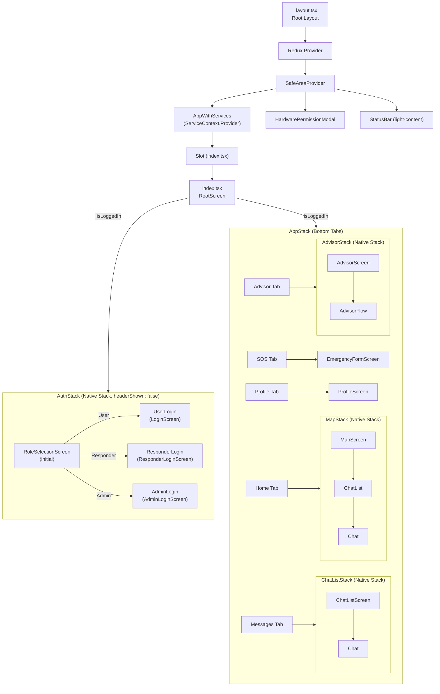
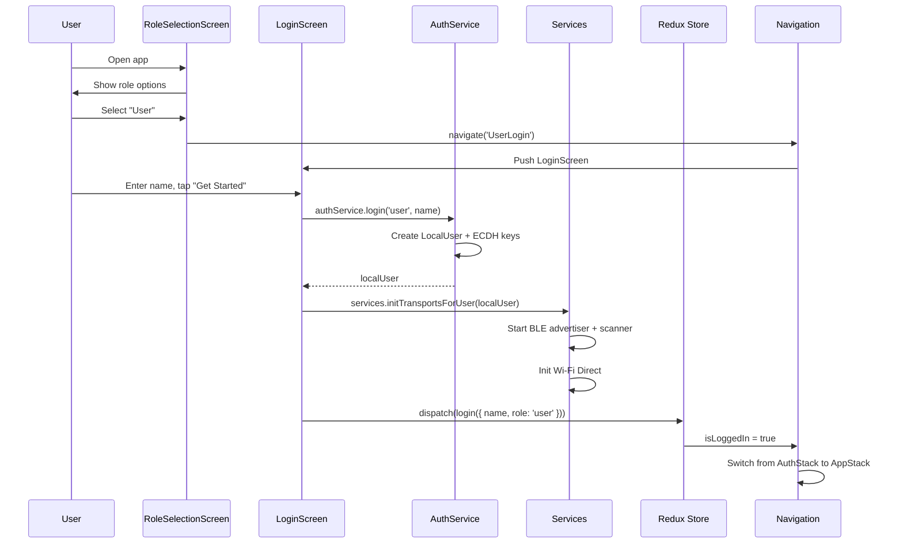

# Mobile Navigation Structure

## Overview

The SOSIFY mobile app uses **Expo Router** (`Slot` / file-based routing) combined with **React Navigation** stacks. Navigation is conditionally switched between an **AuthStack** and an **AppStack** based on Redux auth state.

## Navigation Tree

## Files & Responsibilities

### `app/_layout.tsx` (Root Layout)
- **Path:** `app/_layout.tsx:1-77`
- Imports polyfills (`src/utils/polyfills.ts`)
- Polyfills `crypto.getRandomValues` for non-web platforms using `expo-crypto`
- Wraps the app in:
  1. `<Provider store={store}>` - Redux store
  2. `<SafeAreaProvider>` - safe area insets
  3. `<AppWithServices>` - initializes services via `useInitializeServices` hook, provides `ServiceContext`
  4. `<HardwarePermissionModal>` - overlay for permission enforcement
  5. `<StatusBar barStyle="light-content" />`
- Shows a loading spinner (orange `#FF8C42`) while services initialize

### `app/index.tsx` (Root Screen)
- **Path:** `app/index.tsx:1-51`
- On mount, attempts **session restoration**:
  1. Queries WatermelonDB `local_user` table
  2. Reads `user`, `role`, and `private_key_{deviceId}` from `SecureStore`
  3. If all exist, dispatches `restoreLogin({ name, role })` 
  4. On failure, clears stale `user`/`role` from SecureStore
- Renders `<AppStack />` if `isLoggedIn`, else `<AuthStack />`
- **Note:** `RootNavigator.tsx` exists (`src/navigation/RootNavigator.tsx:1-11`) but is **not used** by the current entry point. The same conditional logic is duplicated in `index.tsx:50`.

### `src/navigation/AuthStack.tsx`
- **Path:** `src/navigation/AuthStack.tsx:1-23`
- `createNativeStackNavigator` with `headerShown: false`
- Screens:

| Route Name       | Component              | Purpose                        |
|------------------|------------------------|--------------------------------|
| `RoleSelection`  | `RoleSelectionScreen`  | Initial screen, pick role      |
| `UserLogin`      | `LoginScreen`          | Name-only login for civilians  |
| `ResponderLogin` | `ResponderLoginScreen` | Name + password for responders |
| `AdminLogin`     | `AdminLoginScreen`     | Name + password for admins     |

### `src/navigation/AppStack.tsx`
- **Path:** `src/navigation/AppStack.tsx:1-202`
- `createBottomTabNavigator` with 5 tabs, dark theme (`#1A1A1A` background, `#FF8C42` active tint)
- `unmountOnBlur: true` on all tabs

#### Tab Configuration

| Tab Name   | Component           | Stack Child              | Icon                    | Notes                                    |
|------------|---------------------|--------------------------|-------------------------|------------------------------------------|
| `Home`     | `MapStack`          | MapScreen, ChatList, Chat| `home`                  | Checks location services on tab press    |
| `Messages` | `ChatListStack`     | ChatListScreen, Chat     | `message-text`          |                                          |
| `SOSModal` | `EmergencyFormScreen` | (direct)               | Red alert badge         | `tabPress` prevented; navigates to modal |
| `Advisor`  | `AdvisorStack`      | AdvisorScreen, AdvisorFlow| `robot-confused`       |                                          |
| `Profile`  | `ProfileScreen`     | (direct)                 | `account`               |                                          |

#### Sub-Stacks

**MapStack** (lines 20-44):
- `MapScreenStack` -> `ChatList` -> `Chat`
- All headers hidden

**ChatListStack** (lines 46-58):
- `ChatListScreen` -> `Chat`
- All headers hidden

**ChatStack** (lines 59-71):
- Duplicate of ChatListStack (identical config, appears unused/redundant)

**AdvisorStack** (lines 73-91):
- `AdvisorScreenStack` -> `AdvisorFlow`
- Default header shown with title "Emergency Advisor", but both screens override `headerShown: false`

#### Special Behaviors
- **Home tab listener** (lines 126-143): Checks `Location.hasServicesEnabledAsync()` on tab press; shows alert to enable location if disabled
- **SOS tab listener** (lines 171-176): Prevents default tab press, navigates to `SOSModal` route explicitly
- **SOS tab icon** (lines 161-169): Custom red circular badge (`#E0005C`) with alert icon

### `src/navigation/RootNavigator.tsx`
- **Path:** `src/navigation/RootNavigator.tsx:1-11`
- Simple conditional: `isLoggedIn ? <AppStack /> : <AuthStack />`
- **Status:** Present in codebase but **not imported** by `app/index.tsx` which implements the same logic inline.

## Auth Flow

## Platform-Specific Notes

| Feature              | Native (iOS/Android)                          | Web                                      |
|----------------------|-----------------------------------------------|------------------------------------------|
| Map rendering        | WebView with inlined Leaflet HTML/JS          | Direct Leaflet via CDN `<script>` tag    |
| Map default coords   | Islamabad, Pakistan (33.6844, 73.0479)        | San Francisco (37.7749, -122.4194)       |
| Peer simulation      | Not available                                 | "Simulate Discovered Peer" button        |
| Service warnings     | Banner for Wi-Fi/BT/GPS off                   | No warning banner                        |
| DB adapter           | SQLite (native) or LokiJS (Expo Go)           | LokiJS                                   |

## TODOs / Incomplete Features

1. **`ChatStack` is a dead duplicate** of `ChatListStack` (`AppStack.tsx:59-71`) - identical config, never referenced
2. **`RootNavigator.tsx` is unused** - the same logic lives in `app/index.tsx:50`
3. **SOS tab as modal** - the tab uses `e.preventDefault()` + `navigation.navigate('SOSModal')` but `SOSModal` is registered as a tab screen, not a separate modal route. This works but is architecturally unusual
4. **Password not validated server-side** - Admin and Responder login screens accept any password >= 6 chars with no backend verification
5. **"Forgot password?" links** are non-functional (`ResponderLoginScreen.tsx:102`, `AdminLoginScreen.tsx:104`)
6. **Profile settings** (Edit Profile, Change Password, Notifications, Help, Terms, Privacy) are all non-functional placeholder buttons
