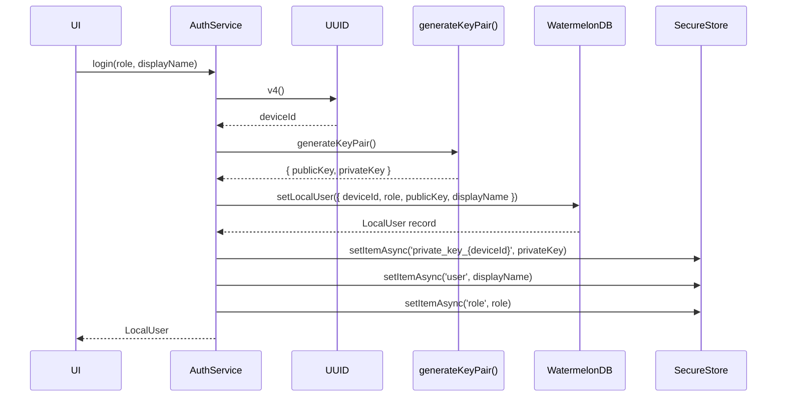
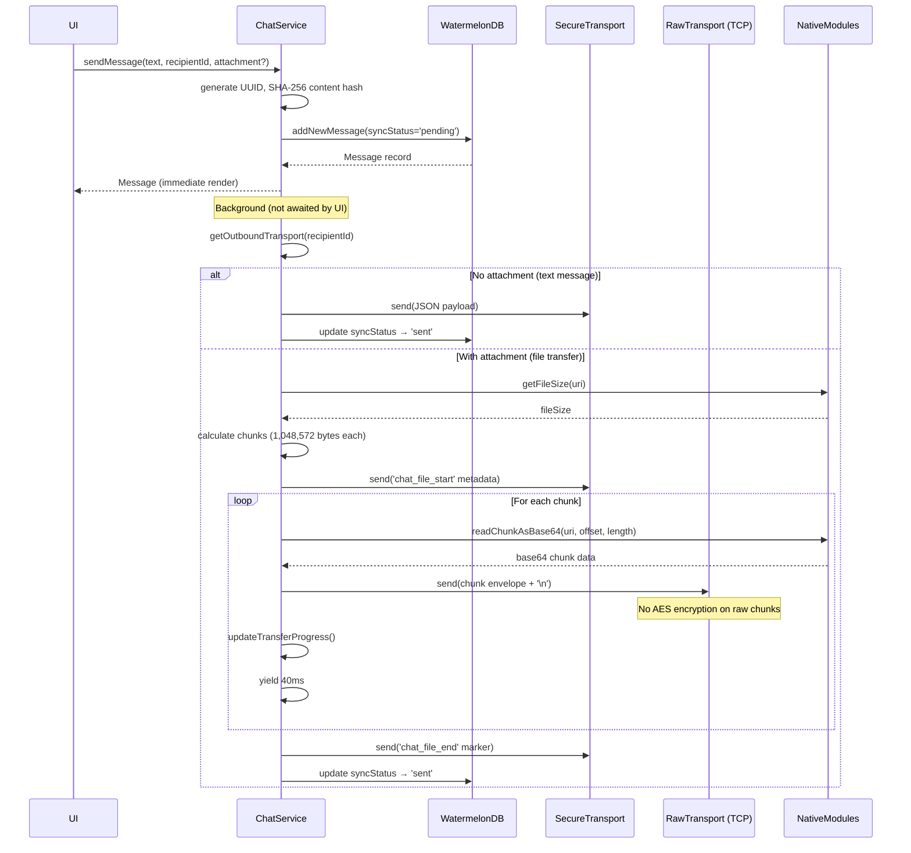
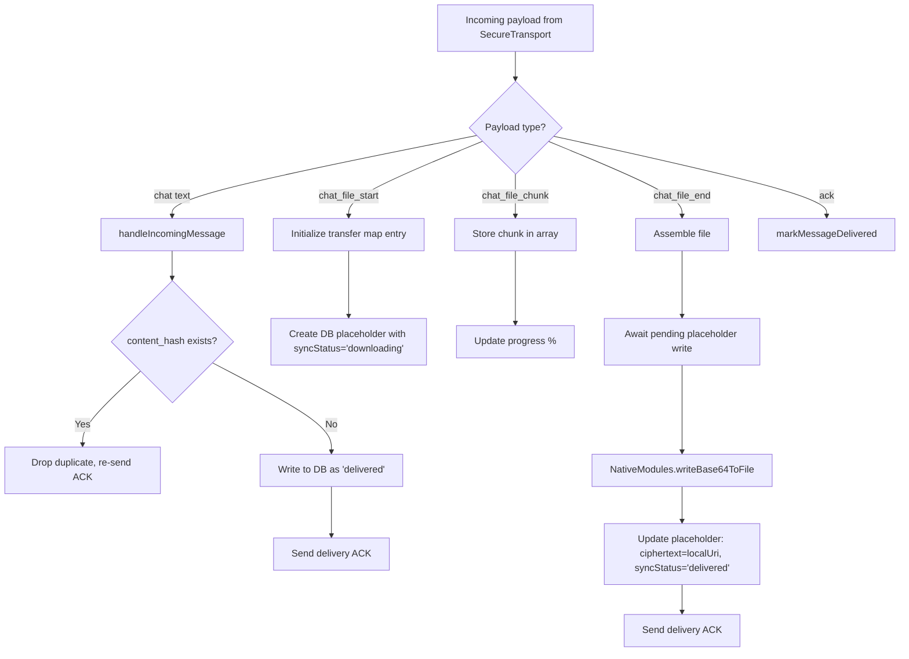
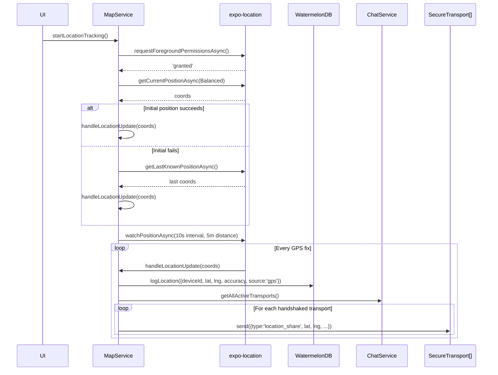
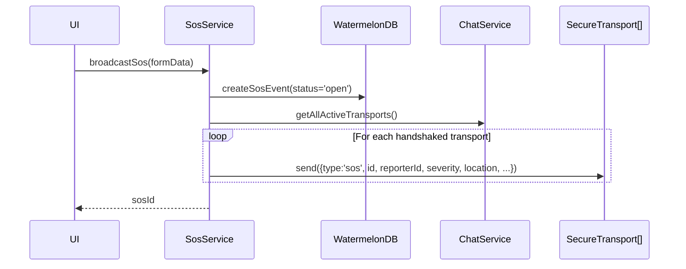
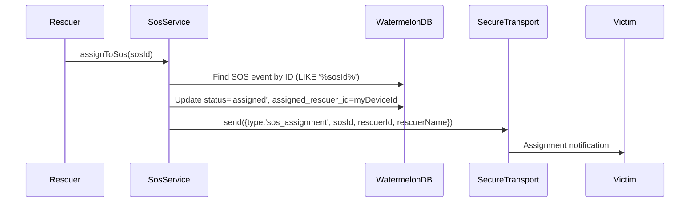

# Mobile Services Layer

> Source: `packages/mobile/src/services/`

---

## 1. AuthService

> Source: `AuthService.ts` (79 lines)
> Purpose: Identity management — registration, key generation, session persistence.

### 1.1 Dependencies

| Dependency | Source | Purpose |
|---|---|---|
| `MobileRepository` | `../db/repository` | DB reads/writes for `local_user` |
| `SecureStore` | `../utils/secureStore` | Encrypted keychain for private key |
| `generateKeyPair` | `shared` | ECDH keypair generation |
| `react-native-uuid` | — | UUID v4 device ID generation |

### 1.2 Public API

| Method | Parameters | Returns | Behavior |
|---|---|---|---|
| `getCurrentUser()` | — | `Promise<LocalUser \| null>` | Delegates to `repository.getLocalUser()`. |
| `observeCurrentUser()` | — | `Observable<LocalUser[]>` | Live WatermelonDB query observer on `local_user` table. |
| `login(role, displayName)` | `'user' \| 'responder' \| 'admin'`, `string` | `Promise<LocalUser>` | Full registration flow. |
| `logout()` | — | `Promise<void>` | Deletes private key from SecureStore, wipes `local_user` table. |

### 1.3 User Registration Workflow

**Storage split:**

| Data | Location | Rationale |
|---|---|---|
| `deviceId`, `role`, `publicKey`, `displayName` | WatermelonDB `local_user` | Observable, queryable |
| `privateKey` | SecureStore (keychain) | OS-level encryption |
| `user` (displayName), `role` | SecureStore | Quick access without DB query |

> **Flag:** `displayName` and `role` stored in both DB and SecureStore — dual source of truth.

---

## 2. ChatService

> Source: `ChatService.ts` (792 lines)
> Purpose: Message send/receive, file transfers, transport lifecycle, delivery ACKs.

### 2.1 Internal State

| Field | Type | Purpose |
|---|---|---|
| `activeTransports` | `Map<peerId, SecureTransport>` | Active encrypted channels keyed by remote peer |
| `secureTransportsList` | `SecureTransport[]` | All registered transports (including unhandshaked) |
| `transportLastSeenMap` | `Map<peerId, number>` | Epoch-ms timestamp of last data from each peer |
| `incomingFileTransfers` | `Map<msgId, {metadata, chunks}>` | In-progress file receive buffers |
| `transferProgressSubject` | `BehaviorSubject<{msgId: number}>` | Observable progress percentages |

### 2.2 Key Public API

| Method | Parameters | Returns | Behavior |
|---|---|---|---|
| `sendMessage(text, recipientId, attachment?)` | `string, string, {uri, type, name}?` | `Promise<Message>` | Optimistic send. |
| `handleIncomingMessage(payload)` | `{id, senderId, recipientId, text, timestamp}` | `Promise<void>` | Dedup + DB write + ACK. |
| `handleIncomingFilePayload(payload)` | `{type, messageId, ...}` | `Promise<void>` | File chunk assembly. |
| `observeMessagesByRecipient(recipientId, localDeviceId)` | `string, string` | `Observable<Message[]>` | Bidirectional conversation, sorted DESC, limited to 50. |
| `observeConversations()` | — | `Observable<Conversation[]>` | Aggregated conversation list with names, unread counts. |
| `markMessageDelivered(messageId)` | `string` | `Promise<void>` | Advances status from `sent` → `delivered` on ACK receipt. |

### 2.3 Message Send Workflow

**Key design decisions:**
- **Optimistic write**: Message appears in UI immediately as `'pending'` before any network I/O.
- **File chunk size**: 1,048,572 bytes (multiple of 3 to avoid base64 padding corruption).
- **Raw chunks bypass AES**: File chunks sent unencrypted over raw TCP. Wi-Fi Direct assumed private.
- **40ms yield between chunks**: Prevents React Native bridge / socket buffer congestion.

### 2.4 Message Receive Workflow

### 2.5 Heartbeat & Self-Healing

The 10-second heartbeat timer performs:

1. **Handshake timeout**: If a `SecureTransport` is connected but handshake hasn't completed for >30s, disconnects and prunes it.
2. **Peer silence detection**: If no data from a peer for >25s, marks their in-progress file transfers as `'failed'`, disconnects, and unregisters the transport.
3. **Keepalive ping**: Sends `{type: 'ping', senderId, timestamp}` to all active peers.

### 2.6 Retry Logic

`retryPendingMessages(peerId)`:
- Triggered when `registerActiveTransport` is called (new connection established).
- Queries messages where `recipient_id = peerId` AND `sync_status IN ('pending', 'sent')`.
- Re-transmits each. Safe for `'sent'` messages: receiver's dedup check recognizes the repeat.

---

## 3. MapService

> Source: `MapService.ts` (232 lines)
> Purpose: GPS tracking, peer location display, RSSI-based proximity.

### 3.1 Location Tracking Workflow

### 3.2 Peer Location Observation

`observePeerLocations()`:
- Combines WatermelonDB `known_peers` observer with RSSI update subject (throttled to 3s).
- **30-second cutoff**: Peers not seen within 30s are filtered out.
- **Deduplication**: Uses a `Set` to ensure unique `device_id` entries.

> **Flag:** Location broadcast sends to ALL active transports on every GPS fix. No throttling — at 10s GPS intervals with N peers, this generates N messages every 10 seconds.

---

## 4. SosService

> Source: `SosService.ts` (171 lines)
> Purpose: SOS incident creation, broadcast, assignment, reception.

### 4.1 SOS Broadcast Workflow

### 4.2 SOS Assignment Workflow

> **Bug:** `assignToSos` uses `Q.like('%${sosId}%')` to find the SOS event (`SosService.ts:108`). This is a substring match — could match the wrong event. Should use exact match `Q.where('id', sosId)`.

---

## 5. PeerConnectionManager

> Source: `PeerConnectionManager.ts` (392 lines)
> Purpose: Peer discovery → WiFi Direct connection → ECDH handshake → connection lifecycle.

### 5.1 Connection State Machine

See [transport.md](./transport.md#61-connection-state-machine) for full state diagram.

### 5.2 Handshake Sequence

See [transport.md](./transport.md#62-handshake-sequence) for full sequence diagram.

### 5.3 Retry Logic

- **Max retries**: 5 attempts
- **Exponential backoff**: `[200, 400, 800, 1600, 3200]` ms
- **Fast-reconnect debounce**: If last failure was <5s ago, skip re-initiation

### 5.4 Grace Period on Peer Lost

- If peer is `connected` and disappears: 3-second grace period
- If peer rediscovered before timer fires → cancel cleanup
- If timer expires → teardown connection
