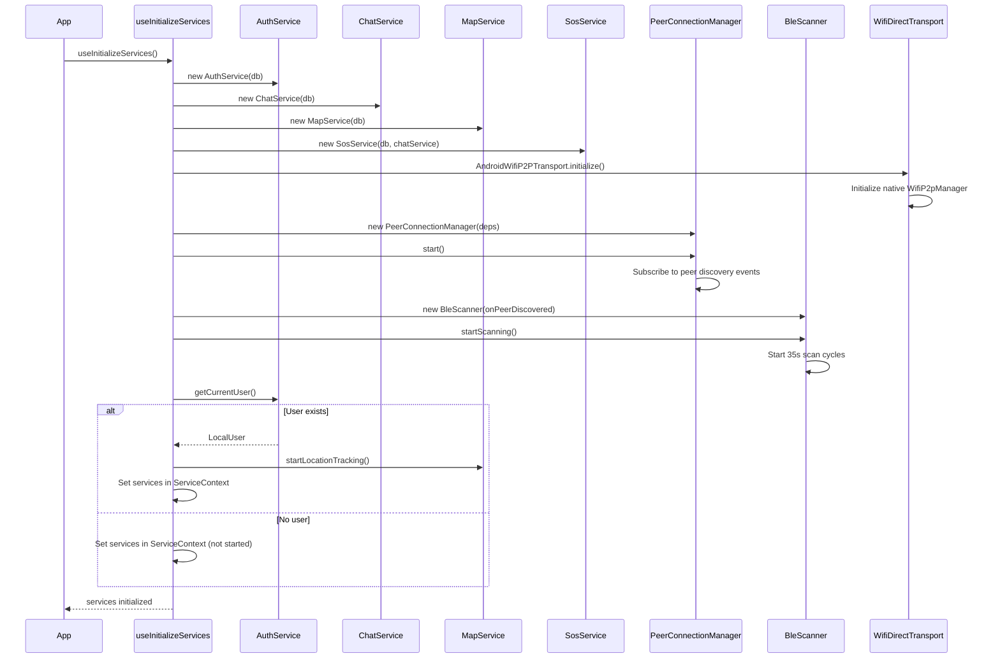
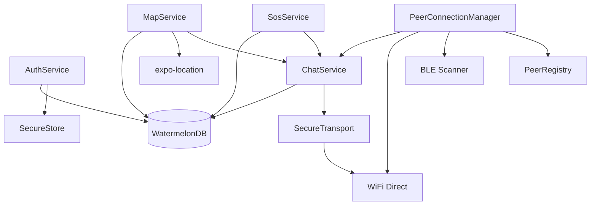
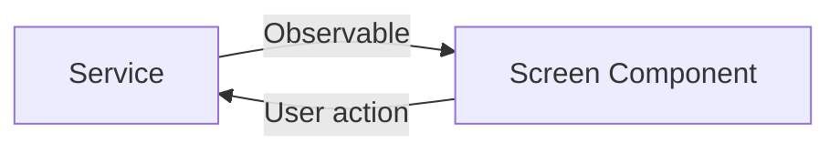
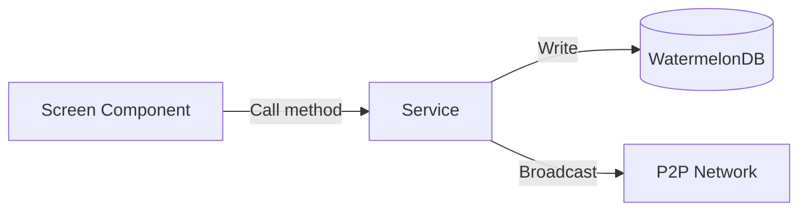
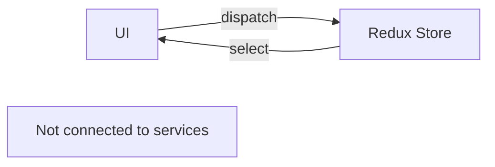

# Mobile State Management

> Source: `packages/mobile/src/redux/`, `packages/mobile/src/hooks/`, `packages/mobile/src/context/`

---

## 1. Redux Store Structure

> Source: `src/redux/store.ts`

```typescript
import { configureStore } from '@reduxjs/toolkit';
import authReducer from './slices/authSlice';
import chatReducer from './slices/chatSlice';
import mapReducer from './slices/mapSlice';
import emergencyReducer from './slices/emergencySlice';
import advisorReducer from './slices/advisorSlice';

export const store = configureStore({
  reducer: {
    auth: authReducer,
    chat: chatReducer,
    map: mapReducer,
    emergency: emergencyReducer,
    advisor: advisorReducer,
  },
});

export type RootState = ReturnType<typeof store.getState>;
export type AppDispatch = typeof store.dispatch;
```

---

## 2. Redux Slices

### 2.1 authSlice

> Source: `src/redux/slices/authSlice.ts`

**State shape:**
```typescript
interface AuthState {
  isAuthenticated: boolean;
  role: 'user' | 'responder' | 'admin' | null;
  displayName: string | null;
  deviceId: string | null;
  teamName: string | null;  // For responders
}
```

**Actions:**
- `login({ role, displayName, deviceId, teamName? })` — Sets `isAuthenticated = true`
- `logout()` — Resets all fields to `null` / `false`

### 2.2 chatSlice

> Source: `src/redux/slices/chatSlice.ts`

**State shape:**
```typescript
interface ChatState {
  activeConversationId: string | null;
  unreadCounts: { [peerId: string]: number };
}
```

**Actions:**
- `setActiveConversation(peerId)` — Sets currently open conversation
- `clearUnread(peerId)` — Resets unread count for peer
- `incrementUnread(peerId)` — Increments unread count

> **Flag:** This slice exists but is **disconnected from UI**. Screens use `ChatService.observeConversations()` directly instead of Redux.

### 2.3 mapSlice

> Source: `src/redux/slices/mapSlice.ts`

**State shape:**
```typescript
interface MapState {
  region: { latitude: number; longitude: number; latitudeDelta: number; longitudeDelta: number };
  showSOSOnly: boolean;
  selectedPeerId: string | null;
}
```

**Actions:**
- `setRegion(region)` — Updates map viewport
- `toggleSOSOnly()` — Filters to show only SOS incidents
- `selectPeer(peerId)` — Highlights a peer on map

### 2.4 emergencySlice

> Source: `src/redux/slices/emergencySlice.ts`

**State shape:**
```typescript
interface EmergencyState {
  isBroadcasting: boolean;
  lastSosId: string | null;
  openIncidents: any[];
}
```

**Actions:**
- `startBroadcast()` — Sets `isBroadcasting = true`
- `broadcastComplete(sosId)` — Sets `isBroadcasting = false`, stores `lastSosId`
- `setOpenIncidents(incidents)` — Updates incident list

> **Flag:** This slice exists but is **disconnected from UI**. `EmergencyFormScreen` uses local state and calls `SosService` directly.

### 2.5 advisorSlice

> Source: `src/redux/slices/advisorSlice.ts`

**State shape:**
```typescript
interface AdvisorState {
  messages: any[];
  isLoading: boolean;
}
```

**Actions:**
- `addMessage(message)` — Appends to message list
- `setLoading(boolean)` — Sets loading state
- `clearMessages()` — Resets message list

> **Flag:** This slice exists but the Advisor feature appears incomplete. Screens may not use this slice.

---

## 3. Service Initialization

> Source: `src/hooks/useInitializeServices.ts`

### 3.1 Initialization Workflow



### 3.2 Service Dependencies



---

## 4. Service Context

> Source: `src/context/ServiceContext.ts`

```typescript
import { createContext } from 'react';
import { AuthService } from '../services/AuthService';
import { ChatService } from '../services/ChatService';
import { MapService } from '../services/MapService';
import { SosService } from '../services/SosService';
import { PeerConnectionManager } from '../services/PeerConnectionManager';

interface ServiceContextType {
  authService: AuthService | null;
  chatService: ChatService | null;
  mapService: MapService | null;
  sosService: SosService | null;
  peerConnectionManager: PeerConnectionManager | null;
}

export const ServiceContext = createContext<ServiceContextType>({
  authService: null,
  chatService: null,
  mapService: null,
  sosService: null,
  peerConnectionManager: null,
});
```

---

## 5. Custom Hooks

### 5.1 useService

> Source: `src/hooks/useService.ts`

```typescript
export function useService<T extends keyof ServiceContextType>(serviceName: T): ServiceContextType[T] {
  const context = useContext(ServiceContext);
  const service = context[serviceName];
  if (!service) {
    throw new Error(`useService: ${serviceName} not initialized`);
  }
  return service;
}
```

**Usage:**
```typescript
const chatService = useService('chatService');
const mapService = useService('mapService');
```

### 5.2 useInitializeServices

> Source: `src/hooks/useInitializeServices.ts`

**Purpose:** Initializes all services once on app startup, injects into `ServiceContext`.

**Returns:** `{ isInitialized: boolean, error: Error | null }`

---

## 6. Data Flow Patterns

### 6.1 Pattern 1: Service → DB → UI (Reactive)

Used by: `ChatListScreen`, `MapScreen`

```mermaid
flowchart LR
    Service -->|Observable| DB[(WatermelonDB)]
    DB -->|observe()| UI[Screen Component]
    UI -->|User action| Service
```

### 6.2 Pattern 2: Service → UI (Direct)

Used by: `ChatScreen` (messages), `ProfileScreen` (user)



### 6.3 Pattern 3: UI → Service → DB (Write)

Used by: `EmergencyFormScreen`, `LoginScreen`



### 6.4 Pattern 4: Redux (Disconnected)

Used by: `chatSlice`, `emergencySlice`, `advisorSlice`



> **Flag:** Three Redux slices (`chat`, `emergency`, `advisor`) are disconnected from the service layer. Screens use services directly via `useService()` hook or `ServiceContext`. Redux appears to be underutilized or legacy.

---

## 7. State Management Summary

| Layer | Technology | Purpose | Status |
|-------|-----------|---------|--------|
| **Local DB** | WatermelonDB | Persistent data, reactive queries | **Active** |
| **Services** | TypeScript classes | Business logic, P2P communication | **Active** |
| **Context** | React Context | Service injection | **Active** |
| **Redux** | @reduxjs/toolkit | Global UI state | **Partially used** |
| **Local state** | React useState | Screen-specific UI state | **Active** |

**Recommendation:** Redux usage is minimal and disconnected. Consider migrating remaining Redux state to services or local state for consistency.
