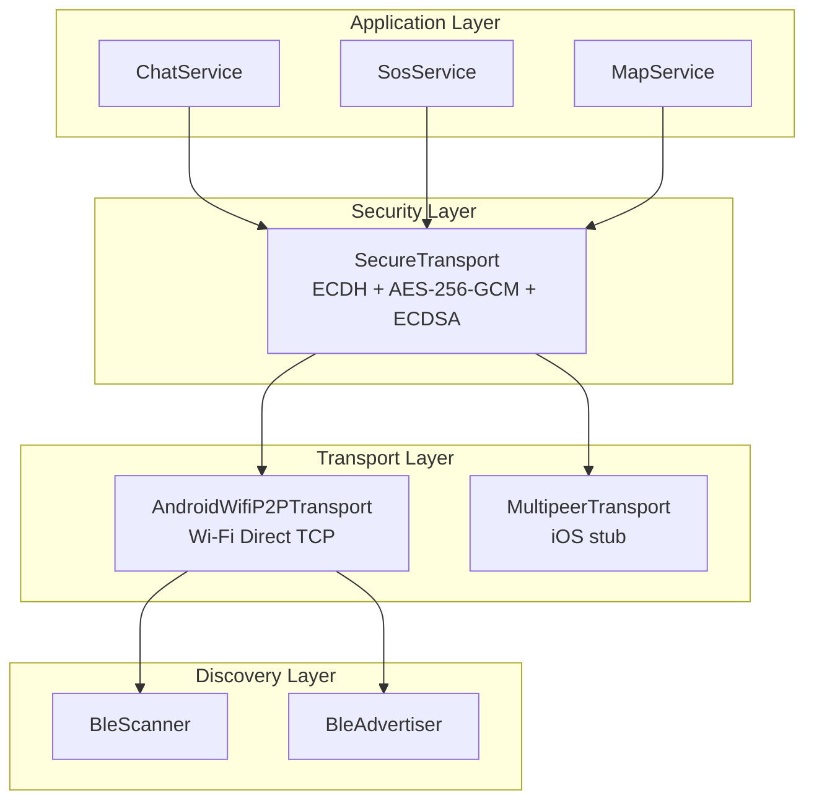
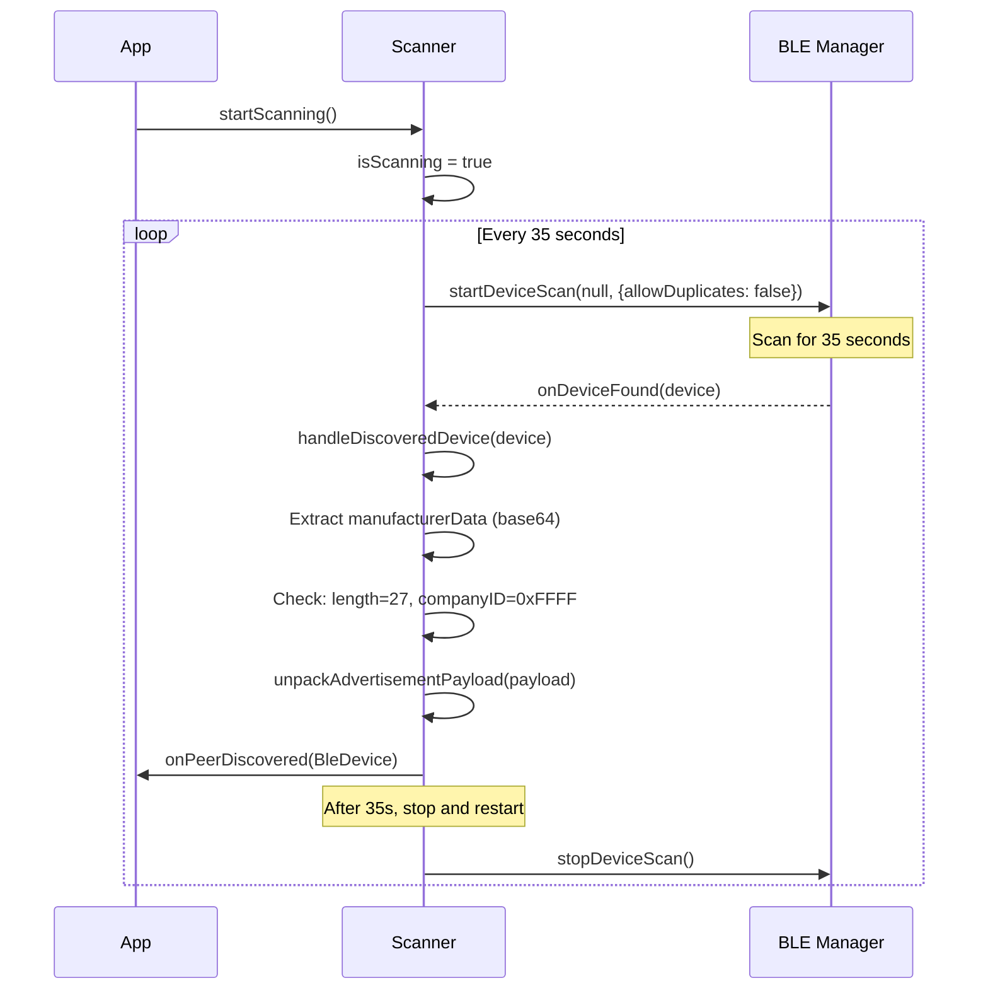
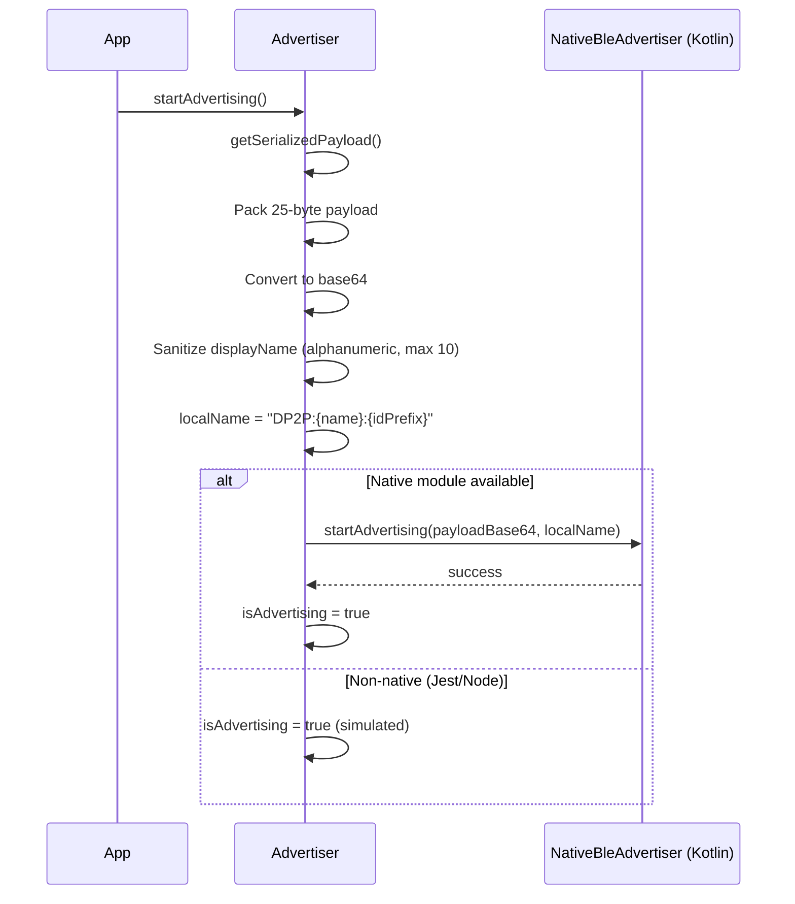
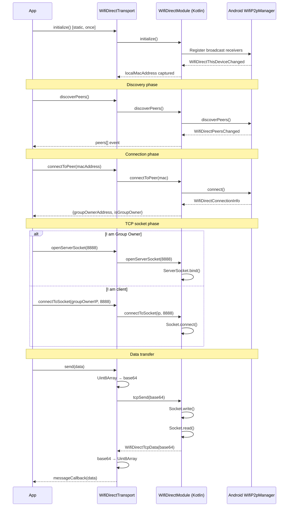
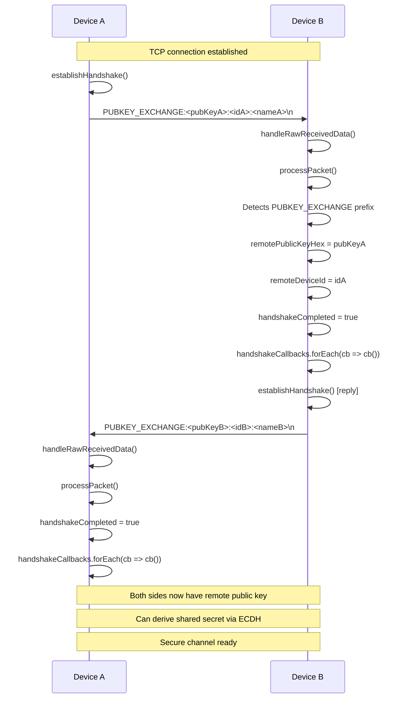
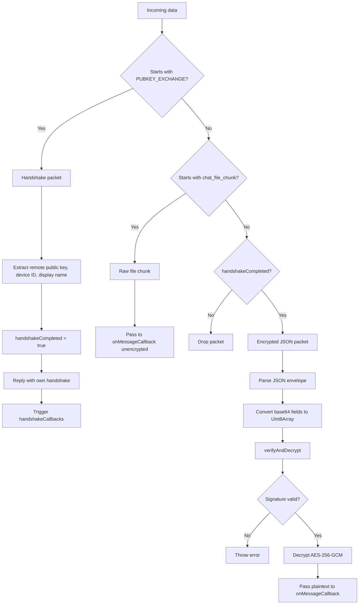
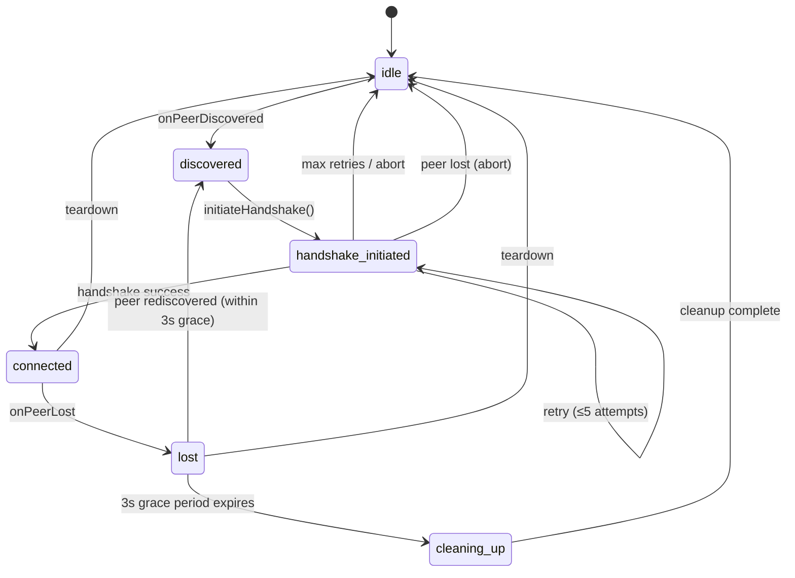
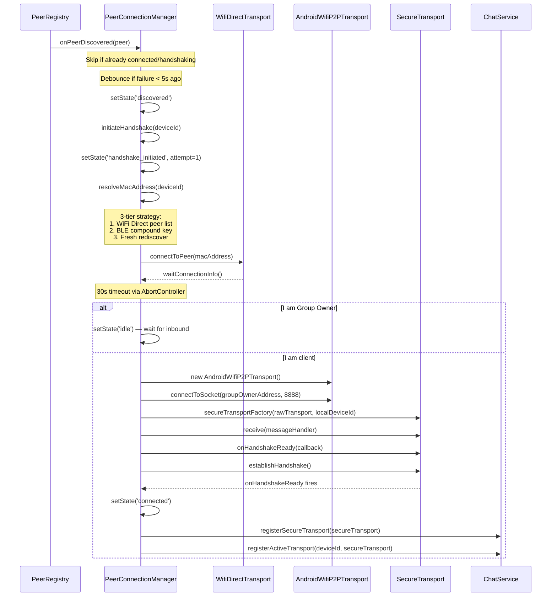

# Mobile Transport Layer

> Source: `packages/mobile/src/comms/`
> Platforms: Android (full), iOS (stub only)

---

## 1. Architecture Overview



---

## 2. BLE Discovery System

### 2.1 Advertisement Packet Format (25 bytes)

> Source: `ble-advertiser.ts:29-58`, `ble-scanner.ts:29-60`

| Offset | Size | Field | Encoding |
|--------|------|-------|----------|
| 0-15 | 16 bytes | `device_id` | UUID (16 bytes, no dashes) |
| 16 | 1 byte | `role` | `0` = user, `1` = responder, `2` = admin |
| 17-20 | 4 bytes | `public_key_hash` | First 4 bytes of SHA-256(public_key), hex |
| 21-24 | 4 bytes | `timestamp` | Unix epoch seconds, **big-endian** |

**On-wire format**: 2 bytes company ID (`0xFFFF`) + 25 bytes payload = **27 bytes total**

### 2.2 BLE Local Name Format

> Source: `ble-advertiser.ts:92-93`

```
DP2P:{displayName}:{deviceIdPrefix}
```

- `displayName`: Sanitized to alphanumeric, max 10 chars
- `deviceIdPrefix`: First 8 chars of device UUID
- Example: `DP2P:Alice:abcd1234`

### 2.3 Scanning Workflow

> Source: `ble-scanner.ts:72-109`



**Duty cycle**: 35s scan, immediate restart (no sleep between cycles)

### 2.4 Advertisement Parsing

> Source: `ble-scanner.ts:29-60`

```typescript
export function unpackAdvertisementPayload(payload: Uint8Array): {
  deviceId: string;
  role: UserRole;
  publicKeyHash: string;
  timestamp: number;
} {
  // 1. Device ID (16 bytes → UUID with dashes)
  const deviceId = bytesToUuid(payload.subarray(0, 16));

  // 2. Role (1 byte)
  const roleVal = payload[16];
  let role: UserRole = 'user';
  if (roleVal === 1) role = 'responder';
  if (roleVal === 2) role = 'admin';

  // 3. Public key hash (4 bytes → hex string)
  const hashParts: string[] = [];
  for (let i = 17; i < 21; i++) {
    hashParts.push(payload[i].toString(16).padStart(2, '0'));
  }
  const publicKeyHash = hashParts.join('');

  // 4. Timestamp (4 bytes, big-endian)
  const view = new DataView(payload.buffer, payload.byteOffset, payload.byteLength);
  const timestamp = view.getUint32(21, false); // Big endian

  return { deviceId, role, publicKeyHash, timestamp };
}
```

### 2.5 Company ID Filtering

> Source: `ble-scanner.ts:145-149`

```typescript
if (rawBytes.length === 27 && rawBytes[0] === 0xFF && rawBytes[1] === 0xFF) {
  // Match found
  const payload = rawBytes.subarray(2); // Skip company ID
  this.onAdvertisementReceived(payload, device.rssi ?? -100, device.name ?? null);
}
```

> **Flag:** Company ID `0xFFFF` is a test/development value. Production should use a registered BLE company ID from the Bluetooth SIG.

### 2.6 Legacy Device Handling

**No legacy device support found.** The scanner expects exactly 27 bytes with company ID `0xFFFF`. Devices with different advertisement formats are silently ignored.

---

## 3. BLE Advertising System

### 3.1 Payload Packing

> Source: `ble-advertiser.ts:29-58`

```typescript
export function packAdvertisementPayload(
  deviceId: string,
  role: UserRole,
  publicKeyHashHex: string,
  timestampSeconds: number
): Uint8Array {
  const payload = new Uint8Array(25);

  // 1. Device ID (16 bytes)
  const uuidBytes = uuidToBytes(deviceId);
  payload.set(uuidBytes, 0);

  // 2. Role (1 byte)
  const roleVal = role === 'user' ? 0 : role === 'responder' ? 1 : 2;
  payload[16] = roleVal;

  // 3. Public key hash (4 bytes)
  const pkHex = publicKeyHashHex.padStart(8, '0');
  const pkHashBytes = new Uint8Array(4);
  for (let i = 0; i < 4; i++) {
    pkHashBytes[i] = parseInt(pkHex.substring(i * 2, i * 2 + 2), 16);
  }
  payload.set(pkHashBytes, 17);

  // 4. Timestamp (4 bytes, big-endian)
  const view = new DataView(payload.buffer, payload.byteOffset, payload.byteLength);
  view.setUint32(21, timestampSeconds, false);

  return payload;
}
```

### 3.2 Advertising Workflow

> Source: `ble-advertiser.ts:81-115`



---

## 4. Wi-Fi Direct Transport (Android)

### 4.1 Connection Lifecycle

> Source: `wifi-p2p-transport.android.ts`



### 4.2 TCP Data Transfer

**Send** (Uint8Array → base64):
> Source: `wifi-p2p-transport.android.ts:325-363`

```typescript
async send(data: Uint8Array): Promise<void> {
  // Direct high-performance Uint8Array → base64 conversion
  const chars = 'ABCDEFGHIJKLMNOPQRSTUVWXYZabcdefghijklmnopqrstuvwxyz0123456789+/';
  const len = data.length;
  const parts = new Array(Math.ceil(len / 3));
  let partIdx = 0;
  
  for (let i = 0; i < len; i += 3) {
    const w1 = data[i];
    const w2 = i + 1 < len ? data[i + 1] : 0;
    const w3 = i + 2 < len ? data[i + 2] : 0;

    const byte1 = w1 >> 2;
    const byte2 = ((w1 & 3) << 4) | (w2 >> 4);
    const byte3 = ((w2 & 15) << 2) | (w3 >> 6);
    const byte4 = w3 & 63;

    let chunkStr = chars.charAt(byte1) + chars.charAt(byte2);
    chunkStr += i + 1 < len ? chars.charAt(byte3) : '=';
    chunkStr += i + 2 < len ? chars.charAt(byte4) : '=';
    
    parts[partIdx++] = chunkStr;
  }
  const base64 = parts.join('');

  await WifiDirect.tcpSend(base64);
}
```

**Receive** (base64 → Uint8Array):
> Source: `wifi-p2p-transport.android.ts:221-248`

```typescript
this.dataSubscription = this.wifiDirectEmitter.addListener(
  'WifiDirectTcpData',
  (base64: string) => {
    if (this.messageCallback) {
      const str = base64.replace(/=+$/, '');
      const len = str.length;
      const byteLen = Math.floor((len * 3) / 4);
      const bytes = new Uint8Array(byteLen);
      
      // Fast base64 decode with lookup table
      // ... (see wifi-p2p-transport.android.ts:230-244)
      
      this.messageCallback(bytes);
    }
  },
);
```

### 4.3 Deterministic Initiator Selection

> Source: `wifi-p2p-transport.android.ts:56`

```typescript
static localMacAddress: string | null = null;
```

When two devices discover each other, both may try to connect simultaneously. To avoid race conditions, the device with the **lower MAC address** initiates the connection.

---

## 5. Secure Transport

### 5.1 Handshake Protocol

> Source: `secure-transport.ts:66-76`

```typescript
async establishHandshake(): Promise<void> {
  const now = Date.now();
  if (now - this.lastHandshakeSentTime < 3000) {
    console.log('[Secure Transport] Handshake request rate-limited (cooldown active).');
    return;
  }
  this.lastHandshakeSentTime = now;
  
  const keyMsg = `PUBKEY_EXCHANGE:${this.localPublicKeyHex}:${this.localDeviceId}:${this.localDisplayName}\n`;
  await this.rawTransport.send(strToBytes(keyMsg));
}
```

**Message format**: `PUBKEY_EXCHANGE:<publicKeyHex>:<deviceId>:<displayName>\n`

**Rate limiting**: 3-second cooldown between handshake attempts

### 5.2 Handshake Workflow



### 5.3 Packet Processing

> Source: `secure-transport.ts:156-222`



### 5.4 Buffer Management

> Source: `secure-transport.ts:132-154`

```typescript
private static readonly MAX_BUFFER_SIZE = 8 * 1024 * 1024; // 8 MB

private handleRawReceivedData(data: Uint8Array): void {
  const chunkStr = bytesToStr(data);
  this.rxBuffer += chunkStr;

  // Guard against runaway buffer growth
  if (this.rxBuffer.length > SecureTransport.MAX_BUFFER_SIZE) {
    console.error('[Secure Transport] rxBuffer exceeded 8MB limit. Clearing buffer to prevent OOM.');
    this.rxBuffer = '';
    return;
  }

  let newlineIndex: number;
  while ((newlineIndex = this.rxBuffer.indexOf('\n')) !== -1) {
    const line = this.rxBuffer.substring(0, newlineIndex);
    this.rxBuffer = this.rxBuffer.substring(newlineIndex + 1);

    if (line.trim() !== '') {
      this.processPacket(line);
    }
  }
}
```

**Protocol**: Newline-delimited JSON. Each packet ends with `\n`.

**Buffer limit**: 8 MB max. If exceeded, buffer is cleared to prevent OOM.

---

## 6. Peer Connection Manager

### 6.1 Connection State Machine

> Source: `PeerConnectionManager.ts:7-14`



### 6.2 Handshake Sequence

> Source: `PeerConnectionManager.ts:112-203`



### 6.3 Retry Logic

> Source: `PeerConnectionManager.ts:205-233`

**Max retries**: 5 attempts

**Exponential backoff**: `[200, 400, 800, 1600, 3200]` ms

```typescript
const backoffDelays = [200, 400, 800, 1600, 3200];
const delay = backoffDelays[attempt - 1] || 3200;
```

**Fast-reconnect debounce**: If last failure was <5s ago, skip re-initiation.

### 6.4 Grace Period on Peer Lost

> Source: `PeerConnectionManager.ts:307-334`

If peer is `connected` and disappears:
- Start 3-second grace period timer
- If peer rediscovered before timer fires → cancel cleanup, preserve connection
- If timer expires → teardown connection

### 6.5 MAC Address Resolution

> Source: `PeerConnectionManager.ts:235-273`

3-tier strategy to resolve BLE device ID → Wi-Fi Direct MAC address:

1. **WiFi Direct peer list**: Match by `deviceName` or `deviceAddress`
2. **BLE compound key**: `${firstWordOfName}:${idPrefix}` → trigger `rediscoverAndWait(2000)` → match WiFi Direct peer by name
3. **Fallback**: Fresh `rediscoverAndWait(2000)` → scan all results

---

## 7. Timings Summary

| Operation | Duration | Source |
|-----------|----------|--------|
| BLE scan cycle | 35 seconds | `ble-scanner.ts:100` |
| Handshake rate limit | 3 seconds | `secure-transport.ts:68` |
| Handshake timeout | 30 seconds | `PeerConnectionManager.ts:130` |
| Retry backoff | 200ms → 3200ms | `PeerConnectionManager.ts:216` |
| Max retry attempts | 5 | `PeerConnectionManager.ts:210` |
| Peer lost grace period | 3 seconds | `PeerConnectionManager.ts:321` |
| Fast-reconnect debounce | 5 seconds | `PeerConnectionManager.ts:296` |
| Buffer max size | 8 MB | `secure-transport.ts:132` |
| Heartbeat interval | 10 seconds | `ChatService.ts:161` |
| Peer silence timeout | 25 seconds | `ChatService.ts:123` |
| Handshake stale timeout | 30 seconds | `ChatService.ts:97` |

---

## 8. iOS Support

> Source: `multipeer/multipeer-transport.ios.ts`

**Status**: Stub only. No native bridge implemented.

The file exists but contains no functional implementation. iOS Multipeer Connectivity framework integration is pending.

---

## 9. Flags & TODOs

| Issue | Location | Description |
|-------|----------|-------------|
| **Test company ID** | `ble-scanner.ts:145` | Uses `0xFFFF` (test/development). Production needs registered BLE company ID. |
| **iOS stub** | `multipeer-transport.ios.ts` | No implementation. iOS support incomplete. |
| **Missing PeerRegistry** | `PeerConnectionManager.ts:4` | Imports `PeerRegistry` but file not found in codebase. |
| **Missing rediscoverAndWait** | `PeerConnectionManager.ts:254, 264` | Calls `wifiDirectTransport.rediscoverAndWait()` but method not found in `AndroidWifiP2PTransport`. |
| **No legacy device support** | `ble-scanner.ts:145` | Only accepts exactly 27 bytes with `0xFFFF` company ID. |
| **Unused service UUID** | `ble-types.ts` | `DISASTER_P2P_SERVICE_UUID` defined but not used in scanner/advertiser. |
| **Inbound GO handshake path** | `PeerConnectionManager.ts:151-154` | Group Owner sets state to `idle` and waits for inbound, but no code handles inbound connections. |
