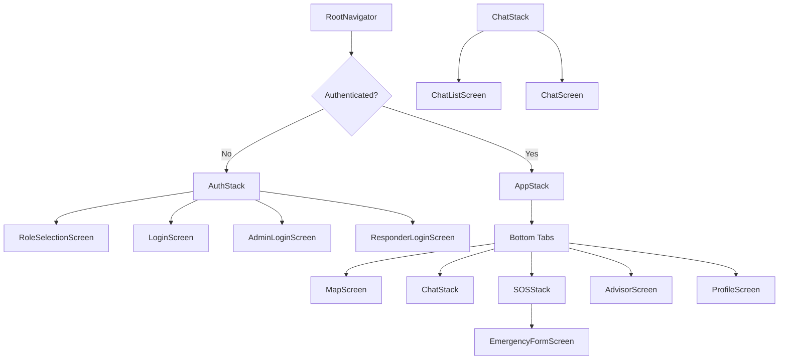
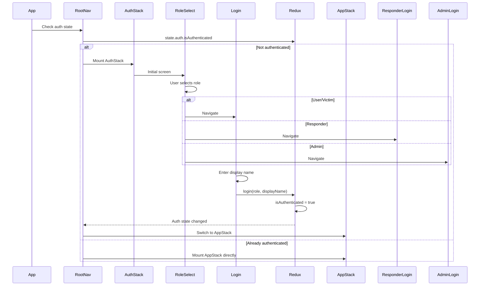
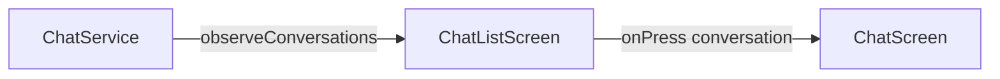
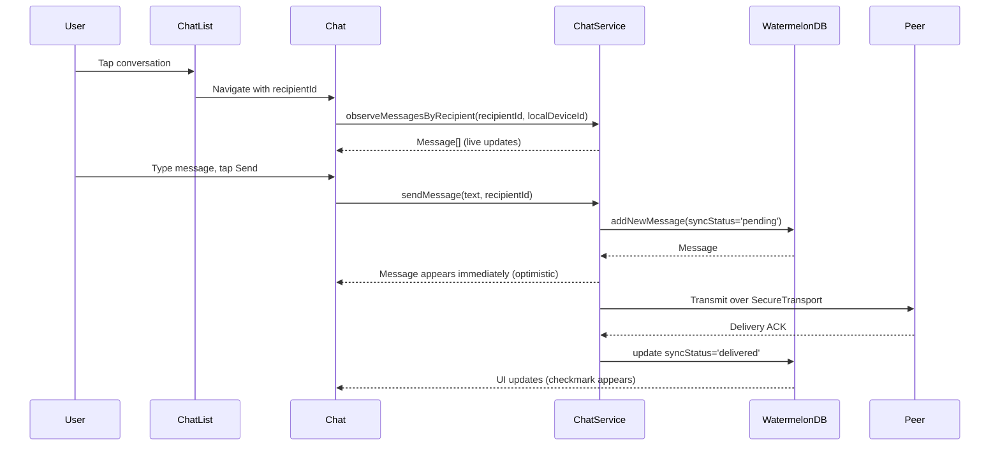
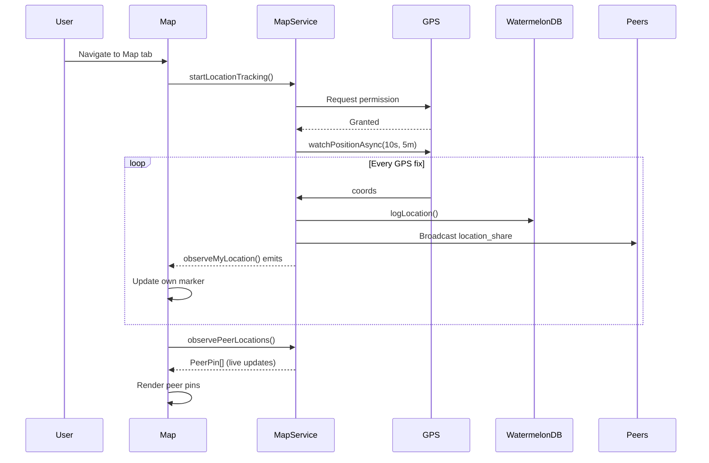
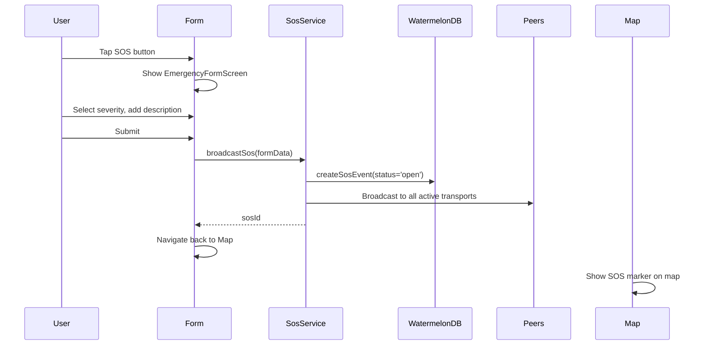

# Mobile Navigation & UI

> Source: `packages/mobile/src/navigation/`, `packages/mobile/src/screens/`, `packages/mobile/app/`

---

## 1. Navigation Structure

### 1.1 Navigation Tree

### 1.2 Auth Flow

### 1.3 Tab Structure

| Tab | Screen | Icon | Purpose |
|-----|--------|------|---------|
| **Map** | `MapScreen` | Map icon | Peer locations, SOS incidents, GPS tracking |
| **Messages** | `ChatListScreen` → `ChatScreen` | Chat bubble | Conversations, file transfers |
| **SOS** | `EmergencyFormScreen` | Alert icon | Create/broadcast emergency |
| **Advisor** | `AdvisorScreen` | Info icon | AI guidance (if implemented) |
| **Profile** | `ProfileScreen` | User icon | User info, logout |

---

## 2. Screen Documentation

### 2.1 Auth Screens

#### RoleSelectionScreen
> Source: `src/screens/auth/RoleSelectionScreen.tsx`

**Purpose**: Initial screen where user selects their role (Victim, Rescuer, Admin).

**Navigation targets:**
- Victim → `LoginScreen`
- Rescuer → `ResponderLoginScreen`
- Admin → `AdminLoginScreen`

#### LoginScreen (User/Victim)
> Source: `src/screens/auth/LoginScreen.tsx`

**Purpose**: Victim registration — display name entry, key generation.

**State:**
- `displayName` (local state)

**Actions:**
- Calls `AuthService.login('user', displayName)`
- Dispatches Redux `authSlice.login()` action
- Navigates to AppStack on success

#### ResponderLoginScreen
> Source: `src/screens/auth/ResponderLoginScreen.tsx`

**Purpose**: Rescuer registration — display name + team name.

**State:**
- `displayName` (local)
- `teamName` (local)

**Actions:**
- Calls `AuthService.login('responder', displayName)`
- Stores team name in Redux `authSlice`

#### AdminLoginScreen
> Source: `src/screens/auth/AdminLoginScreen.tsx`

**Purpose**: Admin login — may require credentials or special flow.

---

### 2.2 App Screens

#### MapScreen
> Source: `src/screens/app/MapScreen.tsx` (native), `MapScreen.web.tsx` (web)

**Purpose**: Real-time map showing peer locations, SOS incidents, own GPS position.

**State:**
- Own location (from `MapService.observeMyLocation()`)
- Peer pins (from `MapService.observePeerLocations()`)
- SOS incidents (from `SosService.observeOpenSosEvents()`)
- Bluetooth enabled status

**Platform differences:**
- **Native**: Uses `react-native-maps` with native map tiles
- **Web**: Uses Leaflet with OpenStreetMap tiles via CDN

**Key features:**
- Peer pins colored by role (user=responder=admin)
- RSSI-based proximity indicator
- SOS incident markers
- Own location marker with accuracy circle

#### ChatListScreen
> Source: `src/screens/app/ChatListScreen.tsx`

**Purpose**: List of all conversations with unread counts.

**State:**
- Conversations (from `ChatService.observeConversations()`)
- Active transports (from `ChatService.observeActiveTransportIds()`)

**Data flow:**

#### ChatScreen
> Source: `src/screens/app/ChatScreen.tsx`

**Purpose**: Individual conversation view — message list, text input, file attachments.

**State:**
- Messages (from `ChatService.observeMessagesByRecipient()`)
- Transfer progress (from `ChatService.observeTransferProgress()`)
- Text input (local state)

**Actions:**
- Send text message → `ChatService.sendMessage()`
- Send file attachment → `ChatService.sendMessage(text, recipientId, attachment)`
- Mark as read → `ChatService.markAsRead()`

**File transfer UI:**
- Progress bar for in-progress transfers
- Image/video/audio preview for completed transfers

#### EmergencyFormScreen
> Source: `src/screens/app/EmergencyFormScreen.tsx`

**Purpose**: SOS incident creation form.

**State:**
- `severity` (local: low/medium/critical)
- `description` (local)
- Current GPS coordinates (from `MapService`)

**Actions:**
- Submit → `SosService.broadcastSos(formData)`
- Navigates back to MapScreen after broadcast

#### ProfileScreen
> Source: `src/screens/app/ProfileScreen.tsx`

**Purpose**: User profile display, logout.

**State:**
- Current user (from `AuthService.observeCurrentUser()`)

**Actions:**
- Logout → `AuthService.logout()` → navigate to AuthStack

#### AdvisorScreen / AdvisorFlowScreen
> Source: `src/screens/app/AdvisorScreen.tsx`, `AdvisorFlowScreen.tsx`

**Purpose**: AI guidance feature (status unclear — may be stub or incomplete).

> **Flag:** These screens exist but their functionality is not fully documented in code. May be a work-in-progress feature.

---

## 3. Reusable Components

### 3.1 HardwarePermissionModal
> Source: `components/HardwarePermissionModal.tsx`

**Purpose**: Modal dialog requesting hardware permissions (Bluetooth, Location).

**Props:**
- `visible: boolean`
- `onGrant: () => void`
- `onDeny: () => void`
- `permissionType: 'bluetooth' | 'location'`

### 3.2 ThemedText / ThemedView
> Source: `components/themed-text.tsx`, `components/themed-view.tsx`

**Purpose**: Theme-aware text and view components that adapt to light/dark mode.

### 3.3 Design System

**Colors** (from `constants/Colors.ts`):
- Light mode: White background, dark text
- Dark mode: Dark background, light text
- Accent colors for roles: User (blue), Responder (orange), Admin (red)

---

## 4. UI Workflow Examples

### 4.1 Sending a Message

### 4.2 Viewing Map

### 4.3 Creating SOS

---

## 5. Flags & TODOs

| Issue | Location | Description |
|-------|----------|-------------|
| **Advisor feature unclear** | `AdvisorScreen.tsx`, `AdvisorFlowScreen.tsx` | Screens exist but functionality not fully implemented or documented. |
| **Unused ChatStack** | `navigation/` | `ChatStack` defined but may not be used in final navigation tree. |
| **Web vs native differences** | `MapScreen.tsx` vs `MapScreen.web.tsx` | Two separate implementations. Need to keep in sync. |
| **No error boundaries** | Screens | No React error boundaries found. Crashes in one screen could affect entire app. |
