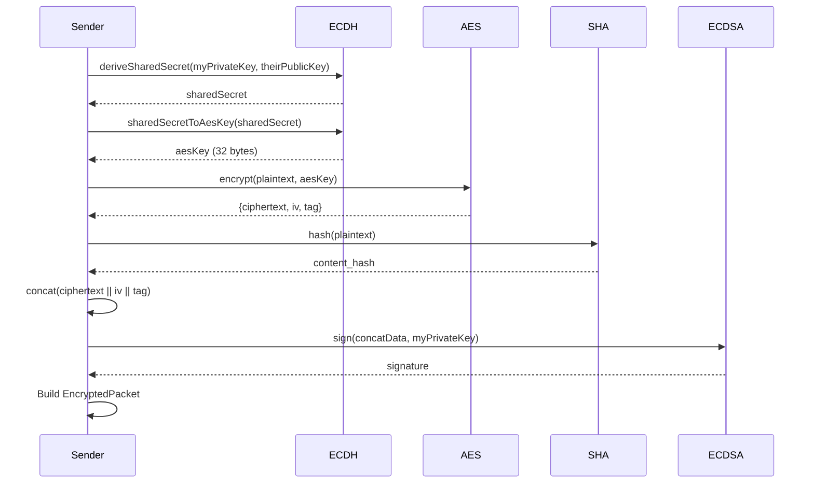
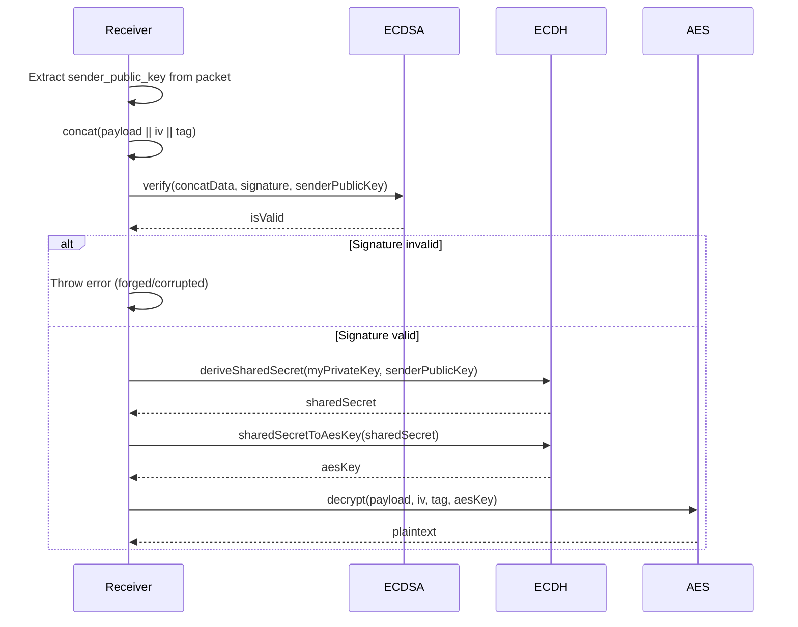

# Shared Cryptographic Primitives

> Source: `packages/shared/src/crypto/`
> Dual implementation: Node.js (`*.ts`) and React Native/Hermes (`*.native.ts`)

---

## 1. Overview

The shared crypto library provides cross-platform cryptographic primitives for the disaster-resilient P2P network. It implements a hybrid cryptosystem combining:

- **ECDH** (Elliptic Curve Diffie-Hellman) for key exchange
- **AES-256-GCM** for symmetric encryption
- **ECDSA** for digital signatures
- **SHA-256** for content hashing and deduplication

---

## 2. Key Generation (ECDH)

> Source: `ecdh.ts:12-20`, `ecdh.native.ts:18-32`

### 2.1 Implementation

**Node.js** (`ecdh.ts`):
```typescript
export function generateKeyPair(): KeyPair {
  const { publicKey, privateKey } = crypto.generateKeyPairSync('ec', {
    namedCurve: 'prime256v1',  // P-256 curve
  });
  return {
    publicKey: publicKey.export({ type: 'spki', format: 'der' }).toString('hex'),
    privateKey: privateKey.export({ type: 'pkcs8', format: 'der' }).toString('hex'),
  };
}
```

**React Native** (`ecdh.native.ts`):
Uses `@noble/curves/p256` for Hermes compatibility:
```typescript
export function generateKeyPair(): KeyPair {
  const privateKey = p256.utils.randomPrivateKey();
  const publicKey = p256.getPublicKey(privateKey);
  // Convert to DER SPKI/PKCS8 format for compatibility
  // ... (see ecdh.native.ts:18-32 for full implementation)
}
```

### 2.2 Key Format

| Field | Format | Encoding | Size |
|-------|--------|----------|------|
| `publicKey` | DER SPKI | Hex string | ~91 bytes (182 hex chars) |
| `privateKey` | DER PKCS8 | Hex string | ~138 bytes (276 hex chars) |

**Key interface** (`ecdh.ts:3-6`):
```typescript
export interface KeyPair {
  publicKey: string;  // Hex encoded DER SPKI
  privateKey: string; // Hex encoded DER PKCS8
}
```

---

## 3. Key Exchange (ECDH)

> Source: `ecdh.ts:25-40`, `ecdh.native.ts:34-54`

### 3.1 Shared Secret Derivation

**Node.js** (`ecdh.ts:25-40`):
```typescript
export function deriveSharedSecret(myPrivateKeyHex: string, theirPublicKeyHex: string): Uint8Array {
  const myPrivateKey = crypto.createPrivateKey({
    key: Buffer.from(myPrivateKeyHex, 'hex'),
    format: 'der',
    type: 'pkcs8',
  });
  const theirPublicKey = crypto.createPublicKey({
    key: Buffer.from(theirPublicKeyHex, 'hex'),
    format: 'der',
    type: 'spki',
  });
  return crypto.diffieHellman({
    privateKey: myPrivateKey,
    publicKey: theirPublicKey,
  });
}
```

**React Native** (`ecdh.native.ts:34-54`):
Uses `@noble/curves/p256` ECDH:
```typescript
export function deriveSharedSecret(myPrivateKeyHex: string, theirPublicKeyHex: string): Uint8Array {
  const shared = p256.getSharedSecret(myPrivateKeyHex, theirPublicKeyHex);
  // Return only the x-coordinate (32 bytes)
  return shared.slice(1, 33);
}
```

### 3.2 AES Key Derivation (HKDF)

> Source: `ecdh.ts:45-55`, `ecdh.native.ts:56-68`

**Node.js** (`ecdh.ts:45-55`):
```typescript
export function sharedSecretToAesKey(sharedSecret: Uint8Array): Uint8Array {
  const salt = new Uint8Array(0);  // Empty salt
  const info = Buffer.from('disaster-p2p-key-derivation');
  return new Uint8Array(crypto.hkdfSync(
    'sha256',
    sharedSecret,
    salt,
    info,
    32 // 256 bits
  ));
}
```

**React Native** (`ecdh.native.ts:56-68`):
Uses `@noble/hashes/hkdf`:
```typescript
export function sharedSecretToAesKey(sharedSecret: Uint8Array): Uint8Array {
  const info = new TextEncoder().encode('disaster-p2p-key-derivation');
  return hkdf(sha256, sharedSecret, new Uint8Array(0), info, 32);
}
```

**HKDF Parameters:**
- **Hash**: SHA-256
- **Salt**: Empty (0 bytes)
- **Info**: `'disaster-p2p-key-derivation'`
- **Output**: 32 bytes (256-bit AES key)

---

## 4. Symmetric Encryption (AES-256-GCM)

> Source: `aes-gcm.ts`, `aes-gcm.native.ts`

### 4.1 Encryption

**Node.js** (`aes-gcm.ts:13-29`):
```typescript
export function encrypt(plaintext: Uint8Array, key: Uint8Array): EncryptedData {
  if (key.length !== 32) {
    throw new Error('AES-256 key must be exactly 32 bytes (256 bits)');
  }
  
  const iv = crypto.randomBytes(12); // 12-byte IV (standard for GCM)
  const cipher = crypto.createCipheriv('aes-256-gcm', key, iv);
  
  const ciphertext = Buffer.concat([cipher.update(plaintext), cipher.final()]);
  const tag = cipher.getAuthTag(); // 16-byte authentication tag
  
  return {
    ciphertext: new Uint8Array(ciphertext),
    iv: new Uint8Array(iv),
    tag: new Uint8Array(tag),
  };
}
```

**React Native** (`aes-gcm.native.ts:33-51`):
Uses `@noble/ciphers/aes`:
```typescript
export function encrypt(plaintext: Uint8Array, key: Uint8Array): EncryptedData {
  const iv = getRandomValues(new Uint8Array(12));
  const aesGcm = gcm(key, iv);
  const encrypted = aesGcm.encrypt(plaintext);
  
  // @noble/ciphers returns ciphertext || tag concatenated
  const ciphertext = encrypted.slice(0, -16);
  const tag = encrypted.slice(-16);
  
  return { ciphertext, iv, tag };
}
```

### 4.2 Decryption

**Node.js** (`aes-gcm.ts:36-58`):
```typescript
export function decrypt(
  ciphertext: Uint8Array,
  iv: Uint8Array,
  tag: Uint8Array,
  key: Uint8Array
): Uint8Array {
  const decipher = crypto.createDecipheriv('aes-256-gcm', key, iv);
  decipher.setAuthTag(Buffer.from(tag));
  
  try {
    const plaintext = Buffer.concat([
      decipher.update(Buffer.from(ciphertext)),
      decipher.final(),
    ]);
    return new Uint8Array(plaintext);
  } catch (error) {
    throw new Error('Decryption failed: authenticity tag validation failed (tampered data)');
  }
}
```

**React Native** (`aes-gcm.native.ts:58-79`):
```typescript
export function decrypt(
  ciphertext: Uint8Array,
  iv: Uint8Array,
  tag: Uint8Array,
  key: Uint8Array
): Uint8Array {
  // @noble/ciphers expects ciphertext || tag concatenated
  const encrypted = new Uint8Array(ciphertext.length + tag.length);
  encrypted.set(ciphertext);
  encrypted.set(tag, ciphertext.length);
  
  try {
    const aesGcm = gcm(key, iv);
    return aesGcm.decrypt(encrypted);
  } catch (error) {
    throw new Error('Decryption failed: authenticity tag validation failed (tampered data)');
  }
}
```

### 4.3 Encrypted Data Structure

```typescript
export interface EncryptedData {
  ciphertext: Uint8Array;  // Variable length
  iv: Uint8Array;          // 12 bytes
  tag: Uint8Array;         // 16 bytes
}
```

**AES-GCM Parameters:**
- **Key size**: 32 bytes (256 bits)
- **IV size**: 12 bytes (96 bits, standard for GCM)
- **Tag size**: 16 bytes (128 bits)
- **Mode**: Galois/Counter Mode (GCM)

---

## 5. Digital Signatures (ECDSA)

> Source: `ecdsa.ts`, `ecdsa.native.ts`

### 5.1 Signing

**Node.js** (`ecdsa.ts:8-18`):
```typescript
export function sign(message: Uint8Array, privateKeyHex: string): Uint8Array {
  const privateKey = crypto.createPrivateKey({
    key: Buffer.from(privateKeyHex, 'hex'),
    format: 'der',
    type: 'pkcs8',
  });

  const signer = crypto.createSign('SHA256');
  signer.update(message);
  return new Uint8Array(signer.sign(privateKey));
}
```

**React Native** (`ecdsa.native.ts:14-24`):
Uses `@noble/curves/p256`:
```typescript
export function sign(message: Uint8Array, privateKeyHex: string): Uint8Array {
  const msgHash = sha256(message);
  const sig = p256.sign(msgHash, privateKeyHex);
  return sig.toDERRawBytes();
}
```

### 5.2 Verification

**Node.js** (`ecdsa.ts:25-40`):
```typescript
export function verify(message: Uint8Array, signature: Uint8Array, publicKeyHex: string): boolean {
  try {
    const publicKey = crypto.createPublicKey({
      key: Buffer.from(publicKeyHex, 'hex'),
      format: 'der',
      type: 'spki',
    });

    const verifier = crypto.createVerify('SHA256');
    verifier.update(message);
    return verifier.verify(publicKey, Buffer.from(signature));
  } catch (error) {
    return false;  // Malformed key or signature
  }
}
```

**React Native** (`ecdsa.native.ts:26-40`):
```typescript
export function verify(message: Uint8Array, signature: Uint8Array, publicKeyHex: string): boolean {
  try {
    const msgHash = sha256(message);
    return p256.verify(signature, msgHash, publicKeyHex);
  } catch (error) {
    return false;
  }
}
```

**ECDSA Parameters:**
- **Curve**: P-256 (prime256v1)
- **Hash**: SHA-256
- **Signature format**: DER-encoded (both implementations)

---

## 6. Content Hashing (SHA-256)

> Source: `sha256.ts`, `sha256.native.ts`

### 6.1 Implementation

**Node.js** (`sha256.ts:7-11`):
```typescript
export function hash(data: Uint8Array): Uint8Array {
  const sha256 = crypto.createHash('sha256');
  sha256.update(data);
  return new Uint8Array(sha256.digest());
}
```

**React Native** (`sha256.native.ts:8-11`):
```typescript
export function hash(data: Uint8Array): Uint8Array {
  return sha256(data);  // @noble/hashes/sha256
}
```

**Output**: 32 bytes (256 bits)

---

## 7. Message Wrapper (Encrypt + Sign)

> Source: `message-wrapper.ts`

### 7.1 Encrypted Packet Structure

```typescript
export interface EncryptedPacket {
  payload: Uint8Array;          // AES-256-GCM ciphertext
  iv: Uint8Array;               // 12 bytes, random IV
  tag: Uint8Array;              // 16 bytes, auth tag
  signature: Uint8Array;        // ECDSA signature over (ciphertext || iv || tag)
  sender_public_key: Uint8Array; // DER public key bytes
  content_hash: Uint8Array;      // SHA-256 hash of plaintext
}
```

### 7.2 Encrypt and Sign Workflow

> Source: `message-wrapper.ts:51-88`



**Implementation** (`message-wrapper.ts:51-88`):
```typescript
export function encryptAndSign(
  plaintext: Uint8Array,
  senderPrivateKeyHex: string,
  senderPublicKeyHex: string,
  recipientPublicKeyHex: string,
  skipSignature = false
): EncryptedPacket {
  // 1. Derive AES key (cached for speed)
  const aesKey = getCachedAesKey(senderPrivateKeyHex, recipientPublicKeyHex);

  // 2. Encrypt
  const encrypted = encrypt(plaintext, aesKey);

  // 3. Hash plaintext
  const content_hash = hash(plaintext);

  // 4. Sign (ciphertext || iv || tag)
  let signature: any = new Uint8Array(0);
  if (!skipSignature) {
    const dataToSign = concatUint8Arrays([encrypted.ciphertext, encrypted.iv, encrypted.tag]);
    signature = sign(dataToSign, senderPrivateKeyHex) as any;
  }

  // 5. Convert public key hex to Uint8Array
  const senderPublicKeyBytes = hexToUint8Array(senderPublicKeyHex);

  return {
    payload: encrypted.ciphertext,
    iv: encrypted.iv,
    tag: encrypted.tag,
    signature,
    sender_public_key: senderPublicKeyBytes,
    content_hash,
  };
}
```

### 7.3 Verify and Decrypt Workflow

> Source: `message-wrapper.ts:97-121`



**Implementation** (`message-wrapper.ts:97-121`):
```typescript
export function verifyAndDecrypt(
  packet: EncryptedPacket,
  recipientPrivateKeyHex: string,
  skipSignature = false
): Uint8Array {
  // 1. Convert sender_public_key bytes to hex
  const senderPublicKeyHex = uint8ArrayToHex(packet.sender_public_key);

  // 2. Verify signature over (payload || iv || tag)
  if (!skipSignature) {
    const signedData = concatUint8Arrays([packet.payload, packet.iv, packet.tag]);
    const isValidSignature = verify(signedData, packet.signature, senderPublicKeyHex);
    if (!isValidSignature) {
      throw new Error('Verification failed: ECDSA digital signature is invalid (forged or corrupted package)');
    }
  }

  // 3. Derive AES key (cached for speed)
  const aesKey = getCachedAesKey(recipientPrivateKeyHex, senderPublicKeyHex);

  // 4. Decrypt
  return decrypt(packet.payload, packet.iv, packet.tag, aesKey);
}
```

### 7.4 AES Key Cache

> Source: `message-wrapper.ts:29-40`

```typescript
const aesKeyCache = new Map<string, Uint8Array>();

function getCachedAesKey(privateKeyHex: string, publicKeyHex: string): Uint8Array {
  const cacheKey = `${privateKeyHex}:${publicKeyHex}`;
  let key = aesKeyCache.get(cacheKey);
  if (!key) {
    const sharedSecret = deriveSharedSecret(privateKeyHex, publicKeyHex);
    key = sharedSecretToAesKey(sharedSecret);
    aesKeyCache.set(cacheKey, key);
  }
  return key;
}
```

**Purpose**: Avoids recomputing ECDH + HKDF for every message with the same peer.

**Cache key**: `${myPrivateKeyHex}:${theirPublicKeyHex}`

**Potential issue**: Cache grows unbounded. No eviction strategy. For long-running sessions with many peers, this could consume memory.

---

## 8. Helper Functions

### 8.1 Concatenate Uint8Arrays

> Source: `message-wrapper.ts:18-27`

```typescript
export function concatUint8Arrays(arrays: Uint8Array[]): Uint8Array {
  const totalLength = arrays.reduce((sum, arr) => sum + arr.length, 0);
  const result = new Uint8Array(totalLength);
  let offset = 0;
  for (const arr of arrays) {
    result.set(arr, offset);
    offset += arr.length;
  }
  return result;
}
```

### 8.2 Hex ↔ Uint8Array Conversion

> Source: `message-wrapper.ts:74-78` (hex to bytes), `message-wrapper.ts:103-105` (bytes to hex)

**Hex to Uint8Array** (without Buffer, works in Hermes):
```typescript
const hexStr = senderPublicKeyHex;
const senderPublicKeyBytes = new Uint8Array(hexStr.length / 2);
for (let i = 0; i < senderPublicKeyBytes.length; i++) {
  senderPublicKeyBytes[i] = parseInt(hexStr.slice(i * 2, i * 2 + 2), 16);
}
```

**Uint8Array to Hex** (without Buffer, works in Hermes):
```typescript
const senderPublicKeyHex = Array.from(packet.sender_public_key)
  .map((b) => b.toString(16).padStart(2, '0'))
  .join('');
```

---

## 9. Dual Implementation Strategy

### 9.1 Why Two Implementations?

- **Node.js** (`*.ts`): Uses built-in `crypto` module for backend server and tests
- **React Native** (`*.native.ts`): Uses `@noble/*` libraries for Hermes JS engine compatibility

**Problem**: React Native's Hermes engine doesn't support Node.js `crypto` module.

**Solution**: React Native Metro bundler automatically resolves `*.native.ts` files when building for mobile.

### 9.2 Library Choices (React Native)

| Library | Purpose | Source |
|---------|---------|--------|
| `@noble/curves` | ECDH, ECDSA (P-256) | `ecdh.native.ts:1`, `ecdsa.native.ts:1` |
| `@noble/ciphers` | AES-256-GCM | `aes-gcm.native.ts:1` |
| `@noble/hashes` | SHA-256, HKDF | `sha256.native.ts:1`, `ecdh.native.ts:2` |

### 9.3 Secure Random Number Generation

> Source: `aes-gcm.native.ts:12-27`

```typescript
function getRandomValues(array: Uint8Array): Uint8Array {
  if (typeof globalThis !== 'undefined' && globalThis.crypto && typeof globalThis.crypto.getRandomValues === 'function') {
    return globalThis.crypto.getRandomValues(array);
  }
  // Fallback using eval to hide require from static analyzers
  try {
    const req = eval('require');
    const nodeCrypto = req('crypto');
    if (nodeCrypto && typeof nodeCrypto.randomBytes === 'function') {
      const bytes = nodeCrypto.randomBytes(array.length);
      array.set(bytes);
      return array;
    }
  } catch (e) {}
  throw new Error('No secure random number generator available');
}
```

**Note**: Uses `eval('require')` to bypass React Native's static analyzer that would otherwise flag the Node.js `crypto` import.

---

## 10. Discrepancies & Flags

| Issue | Location | Description |
|-------|----------|-------------|
| **AES key cache grows unbounded** | `message-wrapper.ts:29-40` | No eviction strategy. Long-running sessions with many peers could consume memory. |
| **Signature type casting** | `message-wrapper.ts:67, 70` | Uses `as any` type cast for signature. Signature is `Uint8Array` but typed as `any`. |
| **Hex conversion without Buffer** | `message-wrapper.ts:74-78, 103-105` | Manual hex conversion to avoid Buffer dependency. Works but slower than native Buffer. |
| **eval('require') usage** | `aes-gcm.native.ts:18` | Uses `eval` to bypass static analysis. Security concern if code is audited. |
| **Empty salt in HKDF** | `ecdh.ts:46` | HKDF uses empty salt. While not insecure, using a random salt would be more standard. |
| **Info string mismatch** | `ecdh.ts:47` vs `CRYPTO.md:69` | Code uses `'disaster-p2p-key-derivation'`, but `CRYPTO.md` documents `'disaster-p2p'`. Code is correct. |

---

## 11. Summary

The shared crypto library provides a complete, cross-platform cryptographic stack for secure P2P communication:

- **Key exchange**: ECDH P-256 with HKDF-SHA256 key derivation
- **Encryption**: AES-256-GCM (12-byte IV, 16-byte tag)
- **Signatures**: ECDSA-SHA256 (P-256 curve)
- **Hashing**: SHA-256 for content deduplication
- **Message wrapper**: Encrypt-then-sign with AES key caching

Dual implementations ensure compatibility with both Node.js (backend) and React Native Hermes (mobile).
