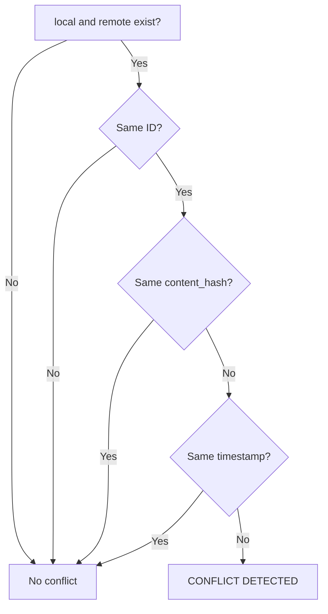
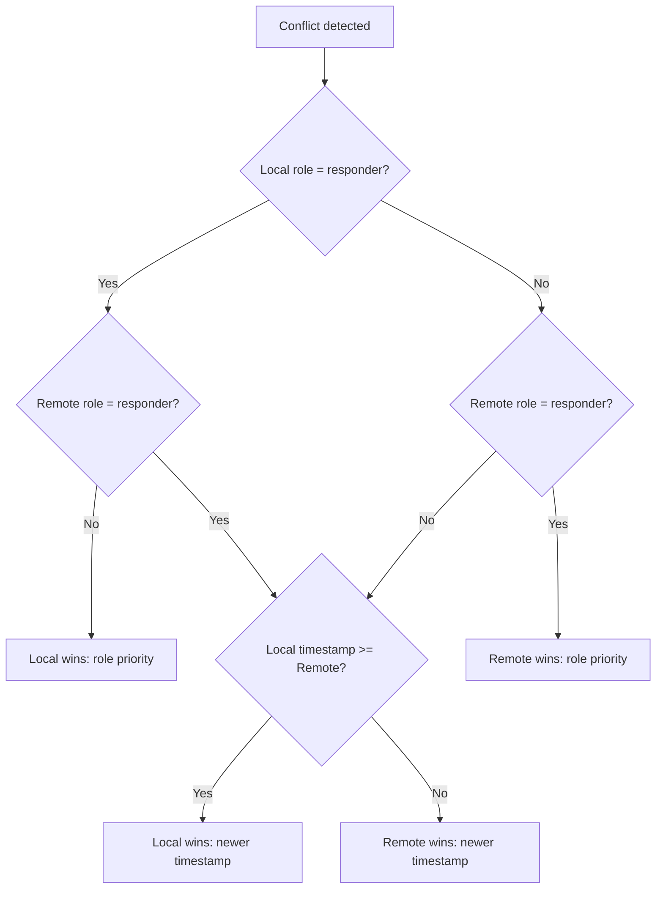
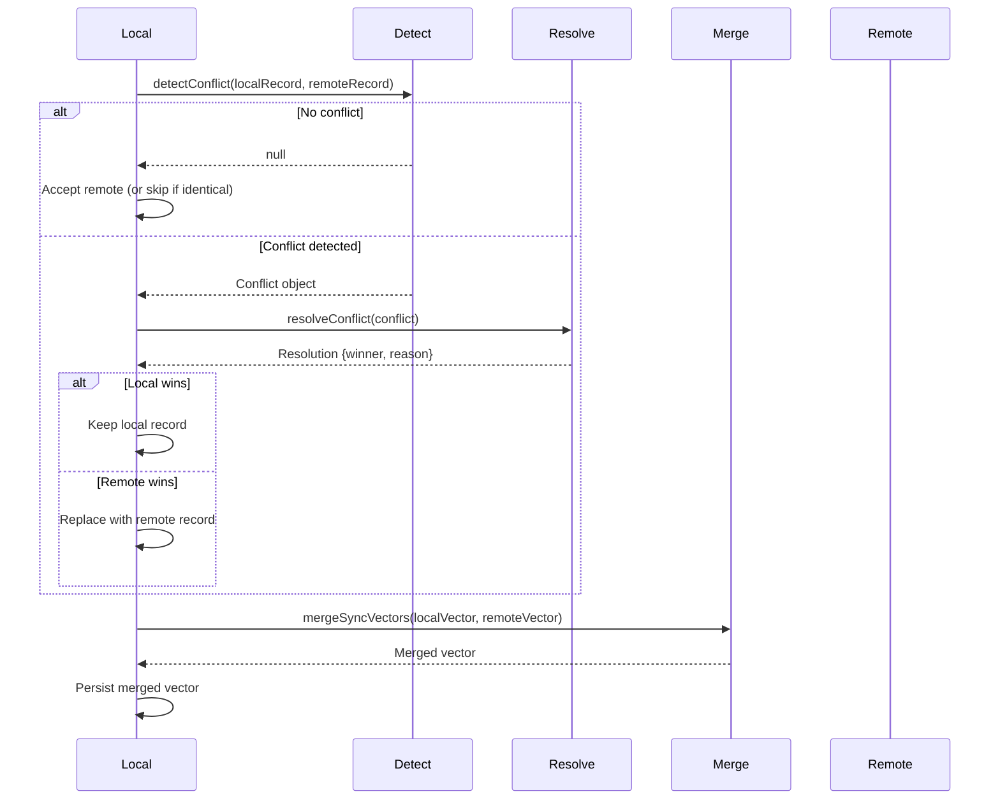

# Shared Sync & Conflict Resolution

> Source: `packages/shared/src/sync/merge-logic.ts`

---

## 1. Overview

The sync module provides conflict-free replicated data type (CRDT) primitives for offline-first P2P data synchronization. It implements:

- **Lamport vector clock** merging
- **Conflict detection** based on content hash and timestamp divergence
- **Role-prioritized conflict resolution**
- **SHA-256 content deduplication**

---

## 2. Types

```typescript
// merge-logic.ts:1
export type SyncVector = Record<string, number>;

// merge-logic.ts:3-8
export interface Conflict {
  record_id: string;
  local_record: any;
  remote_record: any;
  conflict_description: string;
}

// merge-logic.ts:10-13
export interface Resolution {
  winner: 'local' | 'remote';
  reason: string;
}
```

---

## 3. Vector Clock Merge

> Source: `merge-logic.ts:19-27`

### 3.1 Algorithm

For each device ID key, take the **maximum** clock value between local and remote vectors.

```typescript
export function mergeSyncVectors(local: SyncVector, remote: SyncVector): SyncVector {
  const merged: SyncVector = { ...local };
  for (const [deviceId, clockValue] of Object.entries(remote)) {
    if (merged[deviceId] === undefined || clockValue > merged[deviceId]) {
      merged[deviceId] = clockValue;
    }
  }
  return merged;
}
```

### 3.2 Example

```
Local:  { deviceA: 5, deviceB: 3, deviceC: 7 }
Remote: { deviceA: 4, deviceB: 6, deviceD: 2 }
Merged: { deviceA: 5, deviceB: 6, deviceC: 7, deviceD: 2 }
```

### 3.3 Properties

- **Commutative**: `merge(A, B) === merge(B, A)`
- **Idempotent**: `merge(A, A) === A`
- **Monotonic**: Result is always >= both inputs for every key

---

## 4. Conflict Detection

> Source: `merge-logic.ts:33-51`

### 4.1 Detection Criteria

A conflict is detected when ALL of the following conditions are met:

1. Both records exist (non-null)
2. Both records have the same `id`
3. Records have **different** `content_hash` values
4. Records have **different** timestamps (`updated_at` or `created_at`)

```typescript
export function detectConflict(local: any, remote: any): Conflict | null {
  if (!local || !remote) return null;
  if (local.id !== remote.id) return null;

  if (local.content_hash !== remote.content_hash) {
    const localTime = local.updated_at || local.created_at || 0;
    const remoteTime = remote.updated_at || remote.created_at || 0;
    
    if (localTime !== remoteTime) {
      return {
        record_id: local.id,
        local_record: local,
        remote_record: remote,
        conflict_description: `Content hash mismatch with differing timestamps. Local: ${localTime}, Remote: ${remoteTime}`,
      };
    }
  }
  return null;
}
```

### 4.2 Decision Tree



### 4.3 Important Notes

- If content hashes match → no conflict (same data, even if timestamps differ)
- If timestamps match but content differs → no conflict detected (this is a potential gap — simultaneous different edits would not be flagged)
- Uses `updated_at` if available, falls back to `created_at`, then `0`

---

## 5. Conflict Resolution

> Source: `merge-logic.ts:58-82`

### 5.1 Resolution Rules (Priority Order)

**Rule 1: Role priority** — Rescuer (`responder`) overrides victim (`user`)

**Rule 2: Timestamp** — Latest timestamp wins

**Rule 3: Tie-break** — Local wins on equal timestamps

```typescript
export function resolveConflict(conflict: Conflict): Resolution {
  const local = conflict.local_record;
  const remote = conflict.remote_record;

  const localRole = local.role || local.sender_role || '';
  const remoteRole = remote.role || remote.sender_role || '';

  // Rule 1: Rescuer role overrides victim
  if (localRole === 'responder' && remoteRole !== 'responder') {
    return { winner: 'local', reason: 'Rescuer (responder) role overrides victim (user) role' };
  }
  if (remoteRole === 'responder' && localRole !== 'responder') {
    return { winner: 'remote', reason: 'Rescuer (responder) role overrides victim (user) role' };
  }

  // Rule 2: Latest timestamp wins
  const localTime = local.updated_at || local.created_at || 0;
  const remoteTime = remote.updated_at || remote.created_at || 0;

  if (localTime >= remoteTime) {
    return { winner: 'local', reason: 'Newer timestamp wins (local is newer or equal)' };
  } else {
    return { winner: 'remote', reason: 'Newer timestamp wins (remote is newer)' };
  }
}
```

### 5.2 Resolution Flowchart



### 5.3 Role Lookup

The resolver checks two possible field names for role:
1. `record.role`
2. `record.sender_role`

If neither exists, defaults to empty string `''`.

---

## 6. Content Deduplication

> Source: `merge-logic.ts:88-98`

### 6.1 Algorithm

Deduplicates a list of messages by their SHA-256 `content_hash`. Retains the **first** occurrence for each unique hash.

```typescript
export function deduplicateByHash<T extends { content_hash: string }>(messages: T[]): T[] {
  const seen = new Set<string>();
  const result: T[] = [];
  for (const msg of messages) {
    if (!seen.has(msg.content_hash)) {
      seen.add(msg.content_hash);
      result.push(msg);
    }
  }
  return result;
}
```

### 6.2 Usage Context

This is used when merging message lists from multiple peers. In a mesh network, the same message can arrive via multiple routing paths. Deduplication by content hash ensures each unique message is processed exactly once.

---

## 7. Complete Sync Workflow



---

## 8. Discrepancies & Flags

| Issue | Location | Description |
|-------|----------|-------------|
| **Simultaneous edits not detected** | `merge-logic.ts:41` | If `localTime === remoteTime` but content differs, no conflict is detected. This is a gap — two devices editing the same record at the exact same millisecond would silently accept one without flagging. |
| **No admin role priority** | `merge-logic.ts:66-71` | Only `responder` role gets priority. `admin` role is not handled specially — it falls through to timestamp comparison. |
| **Both responders = timestamp** | `merge-logic.ts:66-71` | If both local and remote are `responder`, the role check is skipped and it falls through to timestamp comparison. This is correct but not explicitly documented. |
| **Generic `any` types** | `merge-logic.ts:4-8, 33` | `Conflict` uses `any` for record types. No type safety on what fields are expected. |
| **No vector clock increment** | `merge-logic.ts` | The module merges vectors but doesn't provide a function to increment the local clock before sending. This must be handled by the caller. |
| **Dedup retains first** | `merge-logic.ts:91-95` | `deduplicateByHash` retains the first message encountered. If messages have different metadata (e.g., different `hop_count`), the choice of "first" matters. |

---

## 9. Public API Summary

| Function | Input | Output | Purpose |
|----------|-------|--------|---------|
| `mergeSyncVectors` | `local: SyncVector, remote: SyncVector` | `SyncVector` | Element-wise max merge of two Lamport vectors |
| `detectConflict` | `local: any, remote: any` | `Conflict \| null` | Detects content hash + timestamp divergence |
| `resolveConflict` | `conflict: Conflict` | `Resolution` | Role-priority then timestamp-based winner selection |
| `deduplicateByHash` | `messages: T[]` (with `content_hash`) | `T[]` | Removes duplicate messages by SHA-256 hash |
